# automatedGreenhouse
Greenhouse devices automated by a simple web server based in ESP32 microcontroller.

Aquí hay código para automatizar el encendido/apagado de algunos dispositivos usados en invernaderos. Se usa un Atmega328p cargado con el bootloader de Arduino, comunicación inalámbrica via UART, temporización con un RTC y algo de electrónica para activar contactores de una bomba de riego, ventiladores y/o extractores, y lámparas de cutivo. La principal motivación de este proyecto es generar <b>independencia alimentaria</b> respecto a las especies que se adapten a estas tecnologías, se contempla principalmente hortalizas.

 

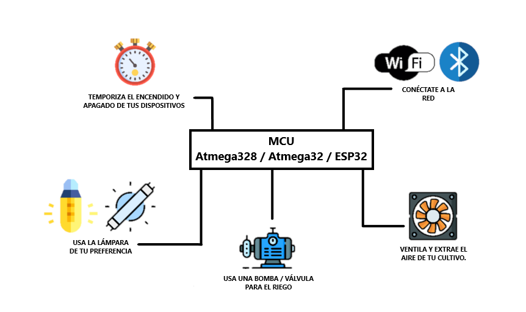 

 

Al finalizar este proyecto se pretende tener una tarjeta de control para usarse con el código contenido en este repositorio. Se actualizara un circuito previamente construido con un <a href="https://www.microchip.com/en-us/product/PIC16F1827">PIC16F1827</a>. Dado el mayor número de pines del <a href="https://ww1.microchip.com/downloads/en/DeviceDoc/ATmega48A-PA-88A-PA-168A-PA-328-P-DS-DS40002061B.pdf">ATMEGA328P</a>, se le agregará funcionalidad a la tarjeta, como poder desplegar información en LCD de 20 X 4. Se contará con diagramas electrónicos, "layout" de componentes, diagramas de conexión eléctrica y la documentacón que se pudiera generar. 

 
 <table align="center">
  <tr>
    <th>&emsp;&emsp;Vista superior.&emsp;&emsp;</th>
    <th>&emsp;&emsp;Vista inferior.&emsp;&emsp;</th>
    <th>&emsp;&emsp;Tarjeta electrónica.&emsp;&emsp;</th>
  </tr>
</table>

  

    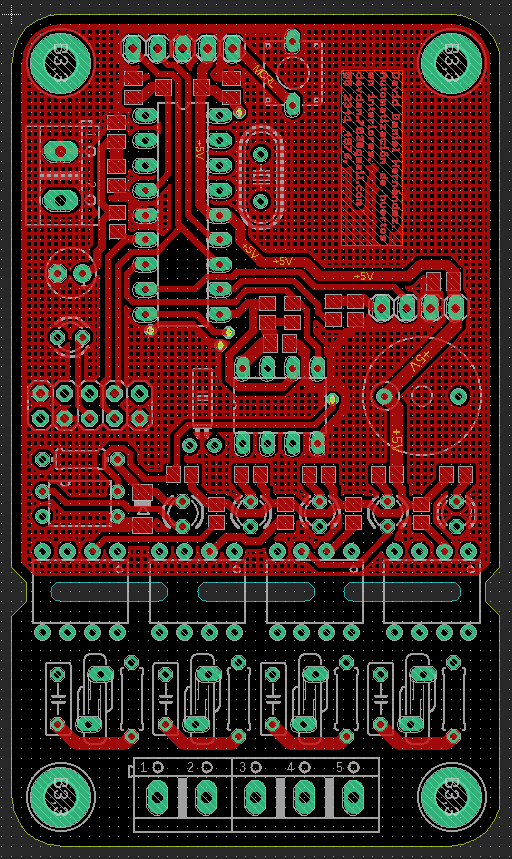&emsp;
    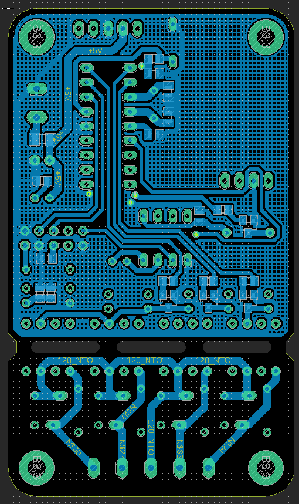&emsp;
    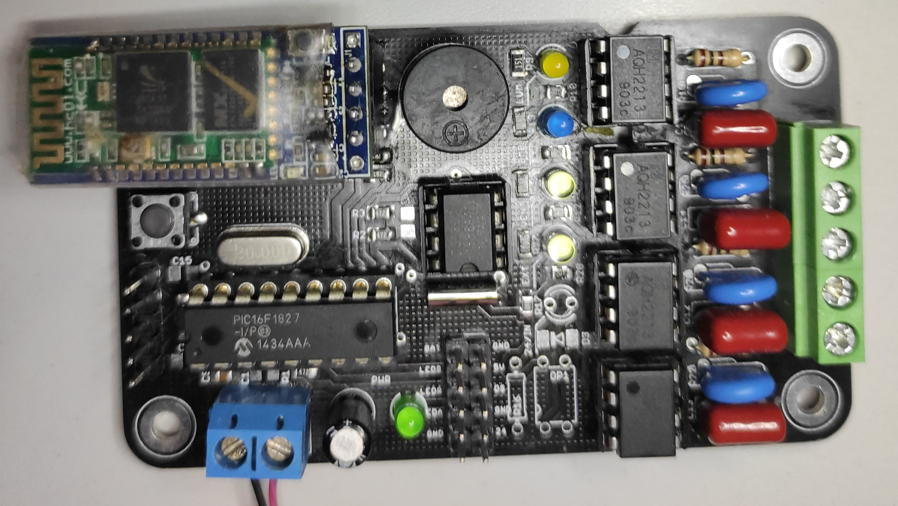
  

# CONTENIDO

* [DISPOSITIVOS A CONTROLAR.](#dispositivos-a-controlar)
  - [LÁMPARAS DE CULTIVO.](#lámparas-de-cultivo)
  - [BOMBA PARA IRRIGACIÓN.](#bomba-para-irrigación)
  - [VENTILACIÓN/EXTRACCIÓN.](#ventilaciónextracción)
* [TARJETA DE CONTROL.](#tarjeta-de-control)
  - [SALIDAS DIGITALES SSR.](#salidas-digitales-ssr)
  - [TEMPORIZACIÓN CON RTC.](#temporización-con-rtc)
  - [CONEXIÓN REMOTA/WIRELESS.](#conexión-remotawireless)
  - [CONTROL DE POTENCIA PWM.](#control-de-potencia-pwm)
  - [TEMPERATURA CON DS18B20.](#temperatura-con-ds18b20)
* [INSTALACIÓN ELÉCTRICA](#instalación-eléctrica)
  - [SELECCIÓN DE CONTACTORES.](#selección-de-contactores)
  - [DIAGRAMAS ELÉCTRICOS.](#diagramas-eléctricos)
  - [CONEXIÓN FINAL.](#conexión-final)

## DISPOSITIVOS A CONTROLAR

Los invernaderos ofrecen muchas ventajas sobre los métodos de agricultura tradicionales. El cultivo de algunas plantas y hortalizas puede adaptarse a espacios dedicados en la ciudad. La tecnología usada en la agricultura protegida también se puede adaptar a estos lugares y puede contemplar la automatización de tareas como el riego, la ventilación y/o extracción de aire, control de fotoperiodo y también la medición de parámetros como temperatura, humedad, PH, etc.

#### LÁMPARAS DE CULTIVO.

El sol como fuente de energía es una muy potente e influye directamente en el desarrollo de vida. Dentro del espectro de radiación solar encontramos la radiación fotosintéticamente activa (PAR), donde los tonos azules y rojos son los más influyentes en el desarrollo de las plantas. La tecnología LED en la actualidad ofrece alternativas para suministro de luz en los cultivos. Se dispone de 1 pin digital del microcontrolador para el control de una lámpara en CA.

 
 <table align="center">
  <tr>
    <th>LEDS ROJOS Y AZULES.</th>
    <th>LEDS BLANCOS.</th>
    <th>OTRAS LÁMPARAS.</th>
  </tr>
</table>
  

    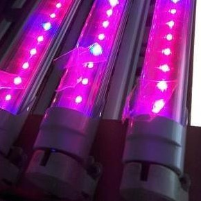&emsp;&emsp;&emsp;&emsp;
    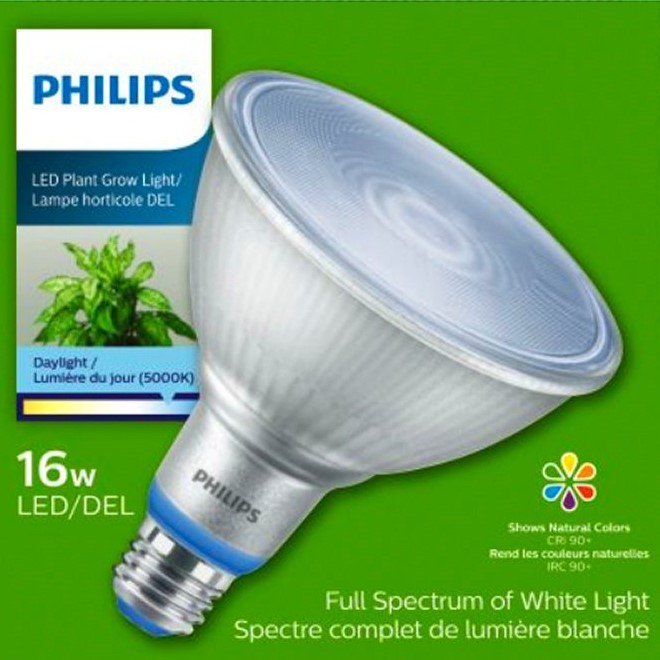&emsp;&emsp;&emsp;&emsp;
    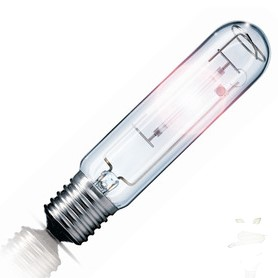
  

#### BOMBA PARA IRRIGACIÓN.
 

Hay diferentes métodos de riego en la agricultura y se pueden mencionar algunos como: riego por asperción, por goteo, por gravedad, película de nutrientes, entre otros. Se hace la generalización de controlar el encendido/apagado de una bomba de agua o una electroválvula para realizar esta tarea. Se dispone de 1 pin digital para el control.

  
  <table align="center">
  <tr>
    <th>&emsp;  GOTEO.  &emsp;</th>
    <th>&emsp;  GRAVEDAD.  &emsp;</th>
    <th>&emsp;  MÉTODO NFT.  &emsp;</th>
    <th>&emsp;  VÁLVULA E.  &emsp;</th>
  </tr>
</table>
  

    <a href="">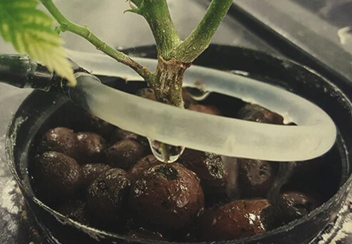</a>&emsp;&emsp;&emsp;&emsp;
    <a href="">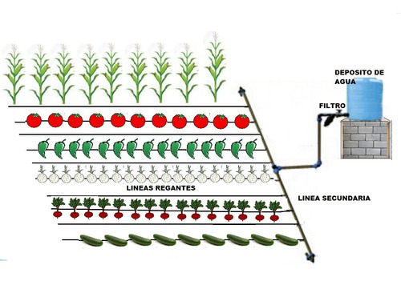</a>&emsp;&emsp;&emsp;&emsp;
    <a href="">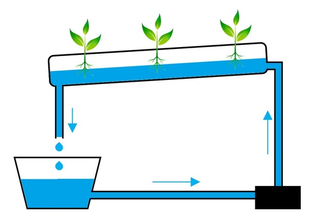</a>&emsp;&emsp;&emsp;&emsp;
    <a href="">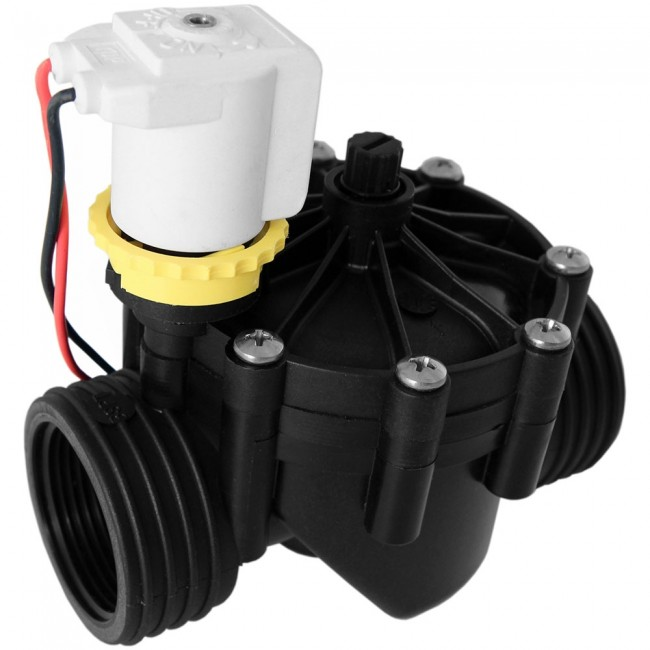</a>
   

#### VENTILACIÓN/EXTRACCIÓN.
 

La calidad del aire de los espacios de cultivo influye en la temperatura y por lo tanto en el desarrollo de las plantas. Si es necesario forzar la cirulación aire limpio en los invernaderos y eliminar el aire viciado se incluyen equipos de extracción, ventilación y algunas veces calefacción. Se dispone de 1 pin digital del microcontrolador para el control de un ventilador y/o extractor en CA.

  
 <table align="center">
      <tr>
        <th>&emsp;  EXTRACTOR 230 W.  &emsp;</th>
        <th>&emsp;  VENTILADOR 250 W.  &emsp;</th>
        <th>&emsp;  EXTRACTOR 760 W.  &emsp;</th>
      </tr>
    </table>
   

    &emsp;&emsp;&emsp;&emsp;
    &emsp;&emsp;&emsp;&emsp;
    
 
 
 
 ## TARJETA DE CONTROL.
 
 
El microcontrolador <a href="https://ww1.microchip.com/downloads/en/DeviceDoc/ATmega48A-PA-88A-PA-168A-PA-328-P-DS-DS40002061B.pdf">ATMEGA328P</a> de Microchip/Atmel es un dispositivo de 8 bits con arquitectura RISC. Cuenta con una memoria de programa de 32 KBytes, 1 KBytes en EEPROM, tiene hasta 23 pines que se pueden configurar como salidas o entradas y puede trabajar desde 1.8 volts hasta 5.5 volts. Algunas características usadas en este proyecto son; I2C, UART, salidas PWM y un bloque de salidas digitales para los actuadores. Se usa el bootloader de la tarjeta Arduino UNO.

 
 #### SALIDAS DIGITALES SSR.
 
Se ocupan 3 salidas digitales para la activación de los dispositivos mencionados (lámpara, bomba de agua y ventilador/extractor). Las salidas del mcu están conectadas individualmente a un SSR <a href="https://b2b-api.panasonic.eu/file_stream/pids/fileversion/2787">AQH2213</a> con un circuito de proteccion sugerido por el fabricante para cargas inductivas como lo es la bobina de los contactores.
 
   
 <table align="center">
  <tr>
    <th>Diagrama típico de conexión.</th>
    <th>Diagrama de conexión final.</th>
  </tr>
  <tr>
    <th><a href="https://b2b-api.panasonic.eu/file_stream/pids/fileversion/2787">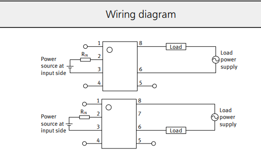</a></th>
    <th>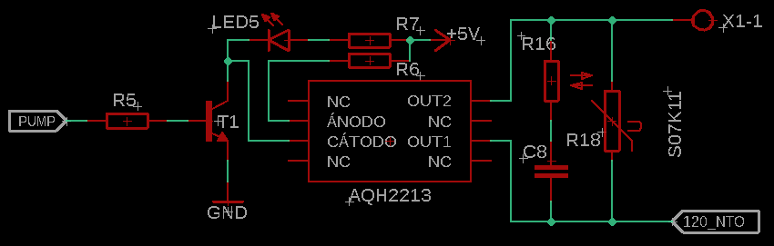</th>
  </tr>
  </table>
  
#### TEMPORIZACIÓN CON RTC.

Para temporizar el encendido y apagado que deben tener los equipos, se usa un <a href="https://datasheets.maximintegrated.com/en/ds/DS1307.pdf">RTC</a> a través de la interface serial I2C. Nuestro dispositivo maestro, realizará lecturas del RTC en el bucle principal y dependiendo de las variables de apagado de cada dispositivo, se procederá a activar o desactivar las salidas correspondientes.
 
  
<table align="center">
  <tr>
    <th>Diagrama típico de conexión.</th>
    <th>Diagrama de conexión final.</th>
  </tr>
  <tr>
    <th><a href="https://datasheets.maximintegrated.com/en/ds/DS1307.pdf">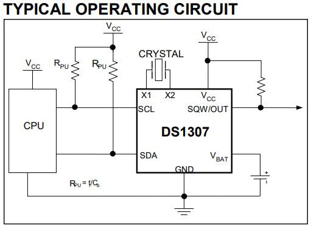</a></th>
    <th>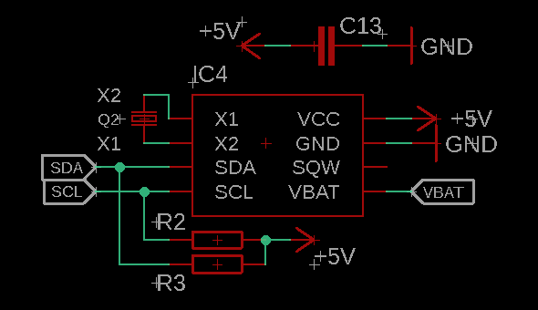</th>
  </tr>
  </table>

#### CONEXIÓN REMOTA/WIRELESS.

La interface USART nos permite hacer comunicaciones con implementaciones como WIFI, BLE, GSM, otros tipos de RF, estándares como RS485, RS232, también se puede adaptar a CAN y LIN. Se usa esta interface para hacer una comunicación via BLE, la cual nos permitirá actualizar y modificar las variables del cultivo.
 
  

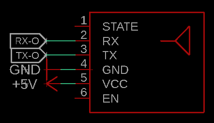 

#### CONTROL DE POTENCIA PWM.

La modulación por ancho de pulso es una técnica eléctronica que se aplica principalmente para el control de potencia.
 
  
 
#### TEMPERATURA CON DS18B20.

Medir la temperaturaen las áreas de cultivo de ha convertido en una labor preventiva. Conociendo el estado de la tamperatura en determinado momento, nos puede ayudar a conocer el coportoamiento del cultivo de acuerdo a ciertos rangos de temperatura. Quedará para una futura actualización de hardware incluir un sistema que efectue acciones correctivas.
 
  

## INSTALACIÓN ELÉCTRICA

Aquí se documentará sobre la instalación eléctrica propuesta.
 

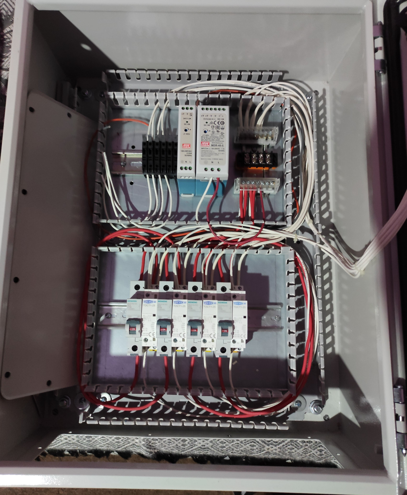 

#### SELECCIÓN DE CONTACTORES.
#### DIAGRAMAS ELÉCTRICOS.
#### CONEXIÓN FINAL.

