# SmartPlant — Controlador de Cultivo IoT

<div align="justify">

SmartPlant es un sistema embebido que controla iluminación por espectro, riego y ventilación de un cultivo indoor, y se configura desde el celular mediante un portal Wi-Fi servido por el propio microcontrolador — sin app, sin nube obligatoria, sin frameworks de terceros. La principal motivación de este proyecto es generar **independencia alimentaria** respecto a las especies que se adapten a estas tecnologías, contemplando principalmente hortalizas.

</div>

<br>
<div align="center">
  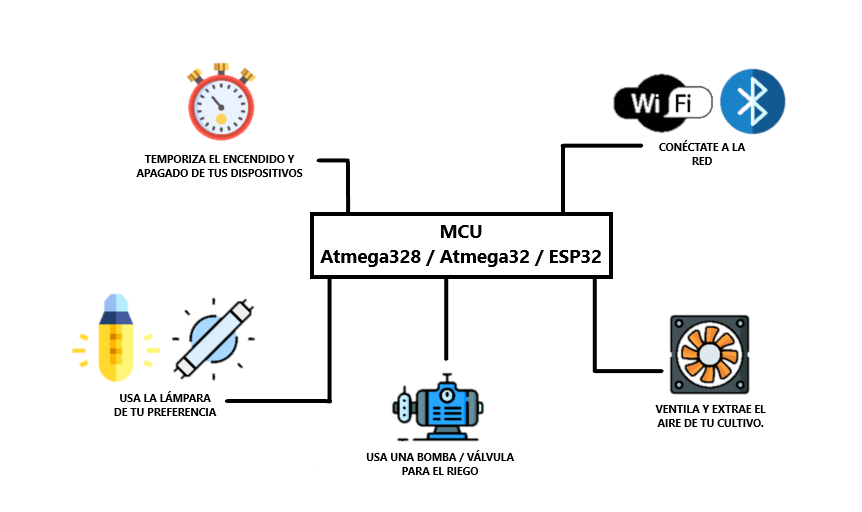
</div>
<br>

<div align="justify">

El proyecto nació como una tarjeta de control basada en un ATmega328P con comunicación BLE y SSR para activar contactores. Desde entonces ha evolucionado a un **ESP32-C3** (RISC-V, 1 núcleo @160 MHz) con portal captivo, frontend embebido y una arquitectura pensada para escalar hacia un backend con telemetría y OTA segura.

</div>

<br>

`C++` · `ESP32-C3` · `Arduino / ESP-IDF` · `Vanilla JS` · `HTML/CSS` · `mbedTLS (planned)` · `FastAPI + PostgreSQL (in progress)`

---

## CONTENIDO

* [QUÉ DEMUESTRA ESTE PROYECTO.](#qué-demuestra-este-proyecto)
* [DECISIONES DE INGENIERÍA.](#decisiones-de-ingeniería)
* [CARACTERÍSTICAS.](#características)
* [ARQUITECTURA.](#arquitectura)
* [EL PORTAL.](#el-portal)
* [DISPOSITIVOS A CONTROLAR.](#dispositivos-a-controlar)
  - [Lámparas de cultivo.](#lámparas-de-cultivo)
  - [Bomba para irrigación.](#bomba-para-irrigación)
  - [Ventilación/Extracción.](#ventilaciónextracción)
* [TARJETA DE CONTROL.](#tarjeta-de-control)
* [STACK TECNOLÓGICO.](#stack-tecnológico)
* [ESTRUCTURA DEL REPOSITORIO.](#estructura-del-repositorio)
* [COMPILAR Y FLASHEAR.](#compilar-y-flashear)
* [ROADMAP.](#roadmap)
* [DOCUMENTACIÓN.](#documentación)

---

## QUÉ DEMUESTRA ESTE PROYECTO

<div align="justify">

Un sistema **embebido de extremo a extremo** construido bajo restricciones reales de hardware (1 núcleo RISC-V @160 MHz, RAM y flash limitadas):

- **Firmware en C++** para ESP32-C3: PWM multicanal, relés, RTC por I²C, persistencia en NVS, servidor HTTP y DNS captivo.
- **Frontend embebido**: una SPA completa (máquina de estados) en un solo HTML con vanilla JS, servida desde el flash del dispositivo — sin build, sin dependencias.
- **Diseño con trade-offs documentados**: cada decisión no trivial (scheduling, sesión, conectividad, validación) está razonada en el código y en la documentación técnica.
- **Mentalidad de producto**: UX cuidada (transiciones, estados de error, accesibilidad), seguridad por capas y un roadmap de backend/OTA pensado para el hardware.

</div>

---

## DECISIONES DE INGENIERÍA

<div align="justify">

La parte interesante de un proyecto embebido no es solo *qué* hace, sino *cómo* resuelve los problemas difíciles que impone el hardware. A continuación se documentan las decisiones más relevantes:

</div>

| Reto | Solución |
|------|----------|
| **Que el riego sobreviva cortes de luz** | Scheduling **stateless**: el encendido se recalcula desde un contador continuo de horas derivado del RTC (`epochHours % intervalo`). El mismo modelo cubre riego sub-diario y espaciado de varios días, sin depender de un contador que se perdería al apagarse. |
| **Edad del cultivo correcta tras estar apagado** | `día`/`semana` se **derivan del calendario real** (ancla `cropStart` en NVS), no de un contador — el cultivo "sigue envejeciendo" aunque el equipo estuviera off, sin desgastar flash cada noche. |
| **Conectar a Wi-Fi sin congelar el portal** | Conexión STA **no bloqueante** + **polling** desde el front: el `POST` solo arranca el intento y responde al instante; el cliente confirma vía `/getparams`. Evita bloquear `handleClient()` varios segundos. |
| **No guardar una contraseña Wi-Fi que no sirve** | **Persistencia diferida**: las credenciales se escriben en NVS *solo* cuando la conexión llega a `WL_CONNECTED` — nada de bucles de reintento tras reiniciar con credenciales inválidas. |
| **Autenticación sin reenviar credenciales** | **Token de sesión** de 128 bits (`esp_random()`), TTL fijo en RAM (muere con el reboot, expiración por `millis()` a prueba de wrap-around). El AP va cifrado con WPA2-PSK. |
| **Validación idéntica en navegador y dispositivo** | Reglas replicadas bit a bit front↔firmware, contando por **carácter UTF-8** (no bytes), para que acentos y ñ no descuadren los límites entre JS y C++. |
| **Servir 50 KB de HTML sin agotar el heap** | `send_P` entrega el portal por trozos directo desde flash. Con `send()` y un `const char*` se creaba un `String` temporal del tamaño completo, y ese pico podía fallar en modo AP+STA dejando el formulario sin cargar. |
| **Menos flash y carga más rápida del portal** | El HTML legible (fuente de verdad) se regenera sin comentarios al artefacto que sirve el ESP32 (~57 → ~49 KB), con `gzip` como siguiente paso (~12–18 KB estimados). |

---

## CARACTERÍSTICAS

<div align="justify">

- **Portal captivo Wi-Fi** (AP "SmartPlant" con WPA2): se configura desde cualquier navegador, sin instalar nada.
- **Iluminación por espectro** (azul / rojo vía PWM, blanco ON/OFF), con fotoperiodo que puede cruzar medianoche.
- **Riego y ventilación** programables por intervalo (de cada hora a semanal).
- **RTC externo DS3231**: la hora se sincroniza desde el navegador del usuario.
- **Conectividad Wi-Fi del usuario** (modo AP+STA condicional) para habilitar nube/telemetría a futuro.
- **Sesión con token** + reset de fábrica protegido.
- **Aplicación de parámetros en vivo** (sin reiniciar el dispositivo).

</div>

---

## ARQUITECTURA

```
┌──────────────┐   Wi-Fi (WPA2)   ┌─────────────────────────────┐
│  📱 Cliente   │ ────────────────▶│   ESP32-C3  "SmartPlant"    │
│ (navegador)  │   HTTP / JSON    │ ┌─────────────────────────┐ │
└──────────────┘                  │ │ Portal captivo (AP)     │ │
                                  │ │ SPA en 1 HTML (vanilla) │ │
                                  │ └─────────────────────────┘ │
   red del usuario   ◀────────────│ ┌─────────────────────────┐ │
   (Internet, futuro)             │ │ STA  (AP+STA condicional)│ │
                                  │ └─────────────────────────┘ │
                                  │  PWM LEDs · Bomba · Fan ·   │
                                  │  RTC DS3231 · NVS · Token   │
                                  └─────────────────────────────┘
```

<div align="justify">

El frontend es una **máquina de estados** (`welcome · register · view · auth · edit · wifi`) contenida en un único archivo HTML; el firmware expone una API JSON y aplica la configuración al instante. Toda la comunicación entre el navegador y el microcontrolador ocurre dentro de la red local del AP — no se requiere internet para operar.

El detalle de cada decisión está en [`docs/ARCHITECTURE.md`](docs/ARCHITECTURE.md); el contrato completo de la API en [`docs/API.md`](docs/API.md).

</div>

---

## EL PORTAL

<div align="justify">

Al conectarse a la red **SmartPlant**, el sistema operativo detecta el portal captivo y abre el formulario automáticamente. Todo el frontend es un único archivo HTML con JavaScript vanilla servido desde el flash del microcontrolador: sin build, sin CDN, sin dependencias.

</div>

<br>
<table align="center">
  <tr>
    <th>Dashboard.</th>
    <th>Edición de parámetros.</th>
    <th>Configuración de red.</th>
  </tr>
  <tr>
    <td></td>
    <td></td>
    <td></td>
  </tr>
</table>
<br>

<div align="justify">

El dashboard muestra el estado del cultivo en modo lectura; para editar hay que autenticarse, lo que emite un token de sesión válido 30 minutos. La vista de red escanea las señales disponibles y permite conectar el dispositivo a la Wi-Fi del usuario sin perder el acceso al portal.

</div>

---

## DISPOSITIVOS A CONTROLAR

<div align="justify">

Los invernaderos ofrecen muchas ventajas sobre los métodos de agricultura tradicionales. El cultivo de algunas plantas y hortalizas puede adaptarse a espacios dedicados en la ciudad. La tecnología usada en la agricultura protegida también se puede adaptar a estos lugares y puede contemplar la automatización de tareas como el riego, la ventilación y/o extracción de aire, control de fotoperiodo y también la medición de parámetros como temperatura, humedad, pH, etc.

</div>

#### LÁMPARAS DE CULTIVO.

<div align="justify">

El sol como fuente de energía es muy potente e influye directamente en el desarrollo de vida. Dentro del espectro de radiación solar encontramos la radiación fotosintéticamente activa (PAR), donde los tonos azules y rojos son los más influyentes en el desarrollo de las plantas. La tecnología LED en la actualidad ofrece alternativas para suministro de luz en los cultivos. En la implementación actual se dispone de **2 canales PWM** (azul, rojo) que permiten controlar la intensidad de cada espectro de forma granular (0–100 %), más un **canal digital ON/OFF** para el blanco, con un fotoperiodo configurable que admite cruce de medianoche.

</div>

<br>
<table align="center">
  <tr>
    <th>LEDs rojos y azules.</th>
    <th>LEDs blancos.</th>
    <th>Otras lámparas.</th>
  </tr>
</table>
<div align="center">
  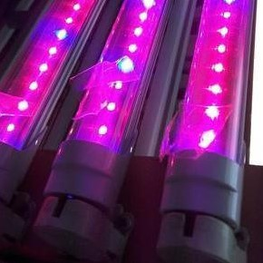&emsp;&emsp;&emsp;&emsp;
  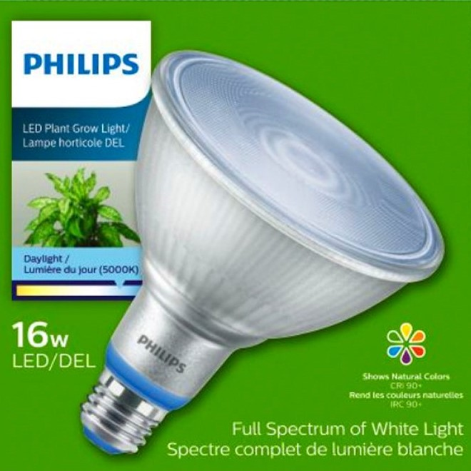&emsp;&emsp;&emsp;&emsp;
  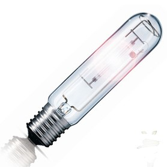
</div>
<br>

#### BOMBA PARA IRRIGACIÓN.

<div align="justify">

Hay diferentes métodos de riego en la agricultura: riego por aspersión, por goteo, por gravedad, película de nutrientes, entre otros. Se hace la generalización de controlar el encendido/apagado de una bomba de agua o una electroválvula para realizar esta tarea. El sistema actual implementa un **scheduling stateless** que recalcula los ciclos de riego directamente desde el RTC, de modo que el riego se ejecuta correctamente incluso después de un corte de energía sin necesidad de persistir contadores.

</div>

<br>
<table align="center">
  <tr>
    <th>&emsp;Goteo.&emsp;</th>
    <th>&emsp;Gravedad.&emsp;</th>
    <th>&emsp;Método NFT.&emsp;</th>
    <th>&emsp;Válvula E.&emsp;</th>
  </tr>
</table>
<div align="center">
  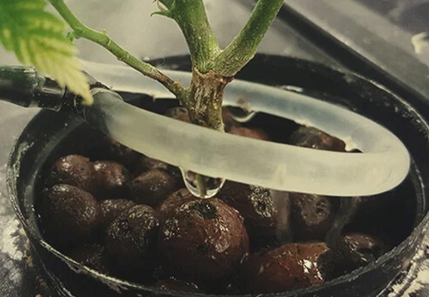&emsp;&emsp;&emsp;&emsp;
  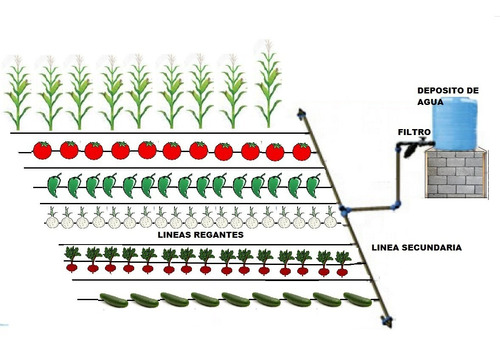&emsp;&emsp;&emsp;&emsp;
  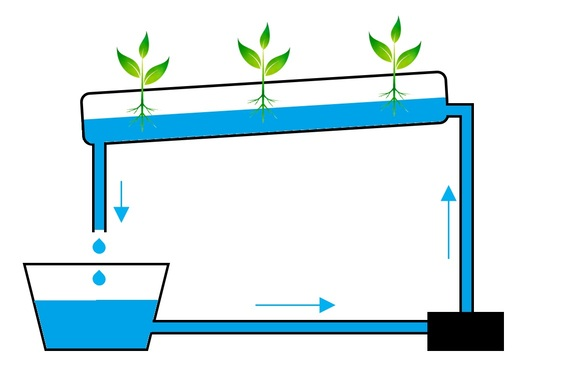&emsp;&emsp;&emsp;&emsp;
  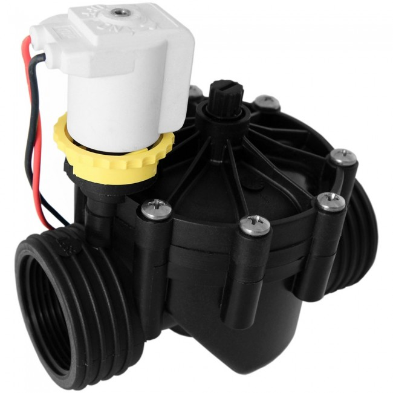
</div>
<br>

#### VENTILACIÓN/EXTRACCIÓN.

<div align="justify">

La calidad del aire de los espacios de cultivo influye en la temperatura y por lo tanto en el desarrollo de las plantas. Si es necesario forzar la circulación de aire limpio en los invernaderos y eliminar el aire viciado, se incluyen equipos de extracción y ventilación. El sistema controla un relé (lógica invertida) para activar el ventilador/extractor en intervalos configurables desde el portal.

</div>

---

## TARJETA DE CONTROL

<div align="justify">

El proyecto inició con un **ATmega328P** de Microchip/Atmel (8 bits, 32 KB flash, I²C, UART, PWM), usando el bootloader de Arduino UNO y comunicación BLE vía UART para actualizar variables del cultivo. La versión actual migró a un **ESP32-C3** (RISC-V, 1 núcleo @160 MHz) que integra Wi-Fi nativo, más memoria y permite servir un portal web completo directamente desde el microcontrolador.

</div>

| Componente | GPIO | Notas |
|-----------|------|-------|
| LED blanco | 0 | Salida digital (lógica invertida) |
| LED azul | 1 | PWM canal 1 |
| LED rojo | 2 | PWM canal 2 |
| Buzzer | 3 | Señalización sonora |
| Ventilador | 7 | Relé (lógica invertida) |
| Bomba de agua | 10 | Relé (lógica invertida) |
| RTC DS3231 | I²C `0x68` | Reloj externo para scheduling |

<div align="justify">

PWM configurado a 1 kHz con resolución de 8 bits (0–255). Los valores de espectro se envían desde el portal como porcentaje (0–100 %) y se escalan internamente en el firmware.

El detalle completo —esquemáticos, salidas SSR, RTC, instalación eléctrica y la tarjeta original— está en **[`docs/HARDWARE.md`](docs/HARDWARE.md)**.

</div>

<br>
<table align="center">
  <tr>
    <th>&emsp;&emsp;Vista superior.&emsp;&emsp;</th>
    <th>&emsp;&emsp;Vista inferior.&emsp;&emsp;</th>
    <th>&emsp;&emsp;Tarjeta electrónica.&emsp;&emsp;</th>
  </tr>
</table>
<div align="center">
  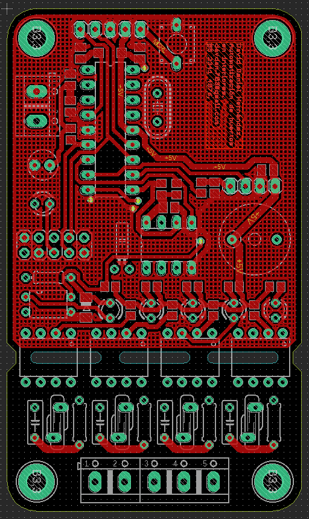&emsp;
  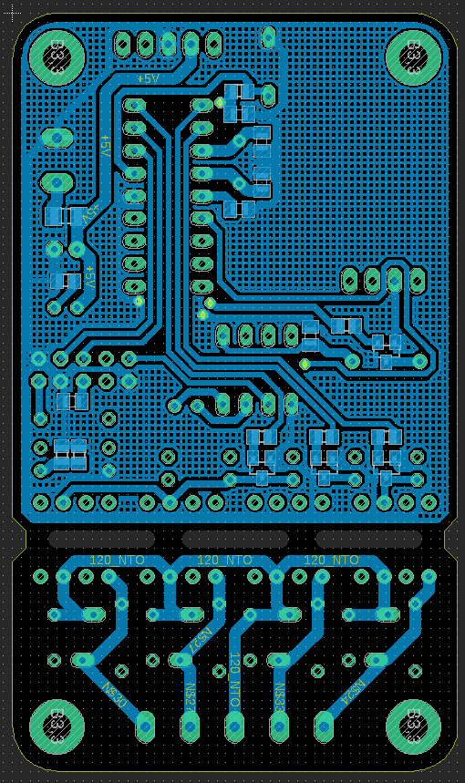&emsp;
  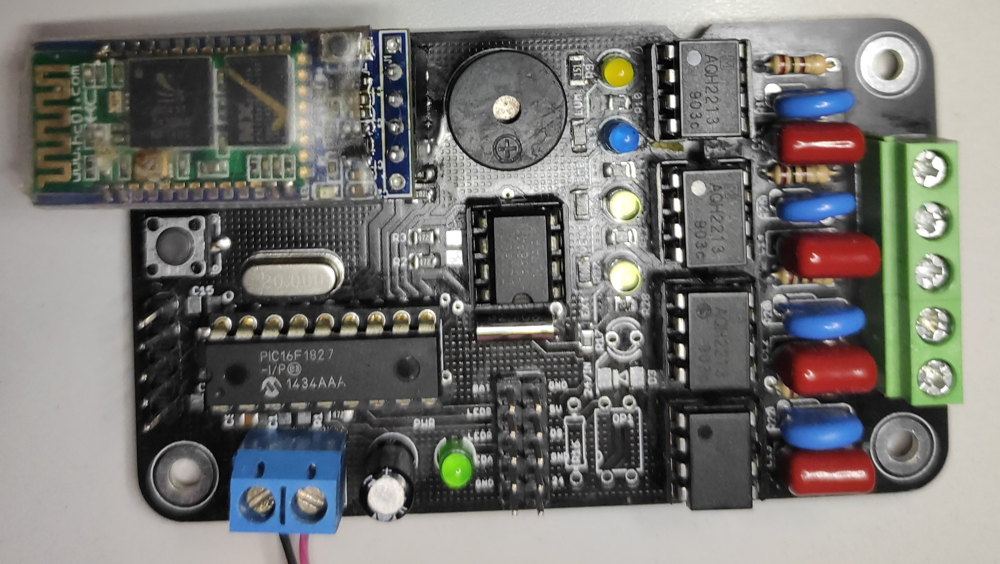
</div>
<br>

---

## STACK TECNOLÓGICO

<div align="justify">

- **MCU:** ESP32-C3 (RISC-V, 1 núcleo @160 MHz)
- **Firmware:** C++ (Arduino-ESP32 / ESP-IDF) — `WiFi`, `WebServer`, `DNSServer`, `Wire`, `Preferences`, `ArduinoJson` (v6)
- **Frontend:** HTML + CSS + JavaScript vanilla (sin frameworks, sin build)
- **Persistencia local:** NVS (Preferences)
- **Backend (diseño fijado, implementación pendiente):** Python (FastAPI), PostgreSQL + TimescaleDB, MQTT, almacenamiento S3-compatible
- **Planeado:** TLS (mbedTLS) y OTA firmada

</div>

---

## ESTRUCTURA DEL REPOSITORIO

```
.
├── ESP32_controller/          # Firmware (sketch de Arduino)
│   ├── ESP32_controller.ino   # AP Wi-Fi, DNS captivo, rutas HTTP y handlers
│   ├── Plant.h / .cpp         # Lógica del cultivo: validación, PWM/relés, RTC, sesión, Wi-Fi
│   ├── Constants.h            # Pines, PWM, límites de validación, enums de estado/error
│   ├── utils.h / .cpp         # Helpers: validación de strings/UTF-8, BCD, fecha
│   ├── sensible.h             # Secretos del AP (no versionado)
│   └── mainForm.h             # Artefacto generado: el HTML que sirve el ESP32
├── HTML/
│   └── mainForm.html          # Fuente de verdad del portal (legible y comentada)
├── ESP32_Board/               # Diseño de la tarjeta (KiCad)
├── pythonServer/              # Backend: FastAPI + Alembic + Docker (auth funcional)
├── docs/                      # Documentación técnica
│   ├── README.md              # Índice de la documentación
│   ├── ARCHITECTURE.md        # Diseño del firmware y del portal
│   ├── API.md                 # Referencia de la API HTTP
│   ├── HARDWARE.md            # Pines, periféricos, instalación eléctrica
│   ├── BACKEND.md             # Diseño del backend
│   └── img/                   # Imágenes y diagramas
├── README.md
└── README.en.md
```

<div align="justify">

**Convención del portal:** se edita `HTML/mainForm.html` (fuente legible y comentada) y de ahí se regenera `ESP32_controller/mainForm.h`, que es el artefacto que sirve el dispositivo. Nunca al revés.

</div>

---

## COMPILAR Y FLASHEAR

```bash
# Requisitos: Arduino IDE / arduino-cli con el core ESP32 y ArduinoJson (v6).
# 1. Crear sensible.h con las credenciales del AP (ver plantilla en el código).
# 2. Compilar y flashear el sketch ESP32_controller/ a la placa ESP32-C3.
# 3. Conectarse a la red Wi-Fi "SmartPlant" → el portal captivo abre el formulario.
```

<div align="justify">

No hay test runner automatizado: la validación se hace en hardware. El JS del portal se verifica con `node --check` tras regenerar `mainForm.h` desde el HTML fuente.

</div>

---

## ROADMAP

- [x] Portal captivo + dashboard + edición de parámetros en vivo
- [x] Sesión con token (sin reenviar credenciales)
- [x] Conectividad Wi-Fi del usuario (AP+STA, escaneo, conexión + polling)
- [ ] Servir el portal **gzip** (`Content-Encoding: gzip`) para menos flash y carga más rápida
- [ ] **Backend** (FastAPI + Postgres/Timescale): cuentas, telemetría y consulta entre dispositivos — *esqueleto funcional con auth implementado ([ver estado](pythonServer/README.md)); falta: provisión de dispositivos, telemetría, OTA y lecturas para app*
- [ ] **OTA segura** sobre TLS (CA pinning + firmware firmado)
- [ ] Medición de temperatura y humedad (DS18B20 contemplado en el diseño original)

---

## DOCUMENTACIÓN

<div align="justify">

Toda la documentación técnica vive en **[`docs/`](docs/README.md)**:

- **[docs/ARCHITECTURE.md](docs/ARCHITECTURE.md)** — diseño técnico a fondo: decisiones, trade-offs, caveats, máquina de estados del portal, modelo de BD y estrategia TLS para el C3.
- **[docs/API.md](docs/API.md)** — referencia completa de la API HTTP: rutas, payloads, validaciones, catálogo de errores y ejemplos con `curl`.
- **[docs/HARDWARE.md](docs/HARDWARE.md)** — mapa de pines, PWM, RTC, SSR, conectividad e instalación eléctrica.
- **[docs/BACKEND.md](docs/BACKEND.md)** — diseño del backend (FastAPI + Postgres/Timescale + MQTT + S3): decisiones, modelo de datos y contratos de API. Es la referencia para implementarlo.
- **[pythonServer/README.md](pythonServer/README.md)** — cómo levantar el backend local (FastAPI + Postgres/Timescale, MinIO, Mosquitto).

</div>

---

<div align="center">

**SmartPlant v1.0** · Firmware embebido + portal captivo para cultivo IoT

</div>
