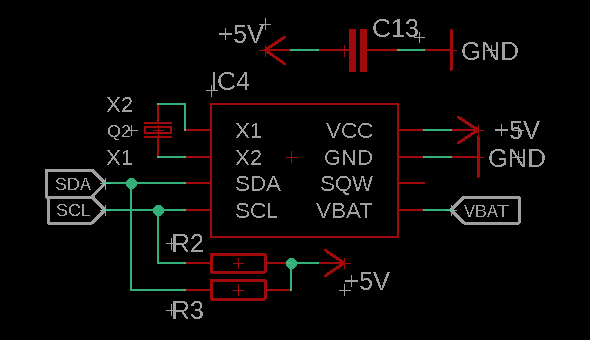

# Hardware

Tarjeta de control, mapa de pines, periféricos y instalación eléctrica.

El controlador es un **ESP32-C3** (RISC-V, 1 núcleo @160 MHz) con Wi-Fi nativo, que sirve el portal captivo desde su propia flash. El diseño eléctrico de potencia (SSR, contactores, gabinete) conmuta las cargas en CA.

---

## Contenido

- [Mapa de pines (ESP32-C3)](#mapa-de-pines-esp32-c3)
- [Control de potencia PWM](#control-de-potencia-pwm)
- [Temporización con RTC](#temporización-con-rtc)
- [Salidas digitales SSR](#salidas-digitales-ssr)
- [Conectividad](#conectividad)
- [Instalación eléctrica](#instalación-eléctrica)
- [Medición de temperatura (DS18B20)](#medición-de-temperatura-ds18b20)

---

## Mapa de pines (ESP32-C3)

Definido en `ESP32_controller/Constants.h`.

| Componente | GPIO | Tipo | Notas |
|---|---|---|---|
| LED blanco | 0 | Digital | Lógica directa (`HIGH` = encendido) |
| LED azul | 1 | PWM canal 1 | 0–100 % desde el portal |
| LED rojo | 2 | PWM canal 2 | 0–100 % desde el portal |
| Buzzer | 3 | Digital | Señalización sonora (cableado; control aún no implementado) |
| Ventilador / extractor | 7 | Relé | Lógica directa |
| Bomba de agua | 10 | Relé | Lógica directa |
| RTC DS3231 | I²C `0x68` | — | Bus `Wire`, para el scheduling |

**Polaridad centralizada:** el nivel que enciende vive en **un solo sitio**, las constantes `deviceOn`/`deviceOff` de `Constants.h`, hoy `HIGH`/`LOW` (lógica directa). Si se cambia a módulos de relé activos en bajo, basta intercambiar esas dos líneas y todo el firmware queda coherente.

**Estado inicial seguro:** `Plant::begin()` llama a `allDevicesOff()` antes de leer cualquier configuración, para que ningún actuador arranque energizado.

**La inicialización de hardware NO va en el constructor:** `Plant planta;` es un objeto global, así que su constructor corre durante la inicialización estática de C++, antes de que el framework de Arduino termine de preparar los periféricos. Configurar GPIO o LEDC ahí puede fallar en silencio o quedar sobrescrito, dejando un pin como entrada flotante en lugar de salida firme; el síntoma típico es un relé o LED con **brillo débil** que no conmuta bien. Por eso `pinMode`, `ledcAttachChannel` y el estado inicial se hacen en `begin()`, invocado desde `setup()`.

**Un solo canal digital para el blanco:** el blanco no tiene PWM asignado, así que solo admite ON/OFF. El portal envía `0` o `1` y el firmware evalúa `> 0`. Los espectros azul y rojo sí son regulables, que es donde la granularidad importa para el PAR.

---

## Control de potencia PWM

La modulación por ancho de pulso se usa aquí para regular la intensidad de cada canal LED de forma independiente, permitiendo adaptar el espectro a la etapa del cultivo — más azul en vegetativo, más rojo en floración.

| Parámetro | Valor |
|---|---|
| Frecuencia | 1 kHz |
| Resolución | 8 bits (duty 0–255) |
| Canales | 2 (azul, rojo) |

Los valores viajan del portal al firmware como **porcentaje 0–100** y se escalan internamente con `map(valor, 0, 100, 0, 255)`. Se eligió exponer porcentaje en la API para que el contrato no dependa de la resolución del PWM: si se sube a 10 bits, el frontend no cambia.

---

## Temporización con RTC

Para temporizar el encendido y apagado de los equipos se usa un **DS3231** por I²C (dirección `0x68`), compensado por temperatura y de baja deriva.

El firmware lee el RTC una vez por segundo desde `loop()` (único punto de I²C periódico, para no compartir el bus `Wire` con otras tareas) y con esa lectura decide qué salidas deben estar activas.

La hora **no** se configura con botones: se sincroniza desde el navegador del usuario en el `POST /newparams`, que incluye fecha y hora completas. El primer `/newparams` con fecha válida ancla `cropStart` en NVS, y a partir de ahí la edad del cultivo se **deriva** del calendario en vez de contarse, de modo que el cultivo sigue envejeciendo aunque el equipo estuviera apagado.

<table align="center">
  <tr>
    <th>Diagrama típico de conexión.</th>
    <th>Diagrama de conexión final.</th>
  </tr>
  <tr>
    <th></th>
    <th></th>
  </tr>
</table>

---

## Salidas digitales SSR

Tres salidas digitales accionan los dispositivos (lámpara, bomba de agua y ventilador/extractor). Cada salida del MCU va a un SSR [AQH2213](https://b2b-api.panasonic.eu/file_stream/pids/fileversion/2787) con el circuito de protección que sugiere el fabricante para cargas inductivas, como la bobina de los contactores.

<table align="center">
  <tr>
    <th>Diagrama típico de conexión.</th>
    <th>Diagrama de conexión final.</th>
  </tr>
  <tr>
    <th></th>
    <th></th>
  </tr>
</table>

---

## Conectividad

El ESP32-C3 aprovecha su Wi-Fi integrado en **modo AP+STA**:

- **AP** (`SmartPlant`, WPA2-PSK): sirve el portal captivo. Siempre arriba.
- **STA**: se conecta a la red del usuario, solo si hay credenciales guardadas. Habilita telemetría y OTA a futuro.

Hay una sola radio, así que AP y STA comparten canal. Dos detalles que costaron depuración y quedan documentados en el firmware:

1. El modo dual se fija **explícitamente** con `WiFi.mode(WIFI_AP_STA)` antes de crear el SoftAP, para que `WiFi.begin()` del STA no reconfigure el modo por debajo.
2. Hay que **desactivar el modem-sleep** con `WiFi.setSleep(false)`. Con el STA habilitado, el ESP32 duerme la radio según el ciclo del STA (`WIFI_PS_MIN_MODEM` por defecto), lo que deja al SoftAP sin responder y el portal no carga.

---

## Instalación eléctrica

Instalación propuesta para la conexión de los actuadores al gabinete de control. Las salidas del microcontrolador no accionan las cargas directamente: pasan por SSR y de ahí a las bobinas de los contactores, que son los que conmutan la potencia en CA.

La selección de contactores, los diagramas eléctricos y la conexión final se documentarán conforme avance la implementación en hardware.

---

## Medición de temperatura (DS18B20)

**Planeada, aún no implementada** en el firmware. Medir la temperatura del área de cultivo es una labor preventiva: conocer su comportamiento dentro de ciertos rangos ayuda a anticipar problemas. Queda para una futura actualización que además pueda ejecutar acciones correctivas.

Los archivos de diseño de la tarjeta están en [`ESP32_Board/`](../ESP32_Board) (KiCad).
