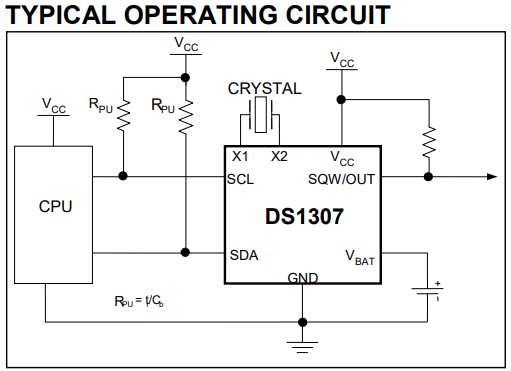
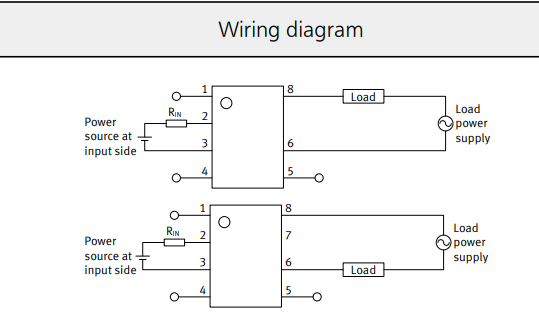
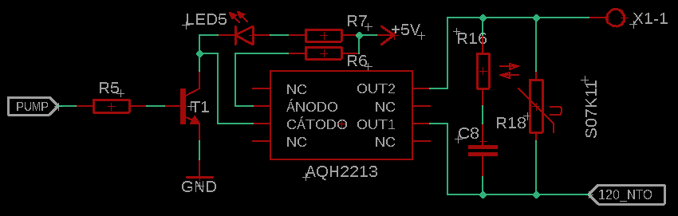
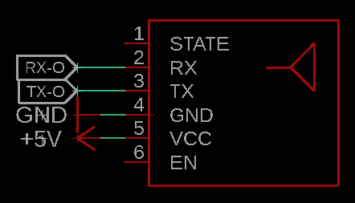
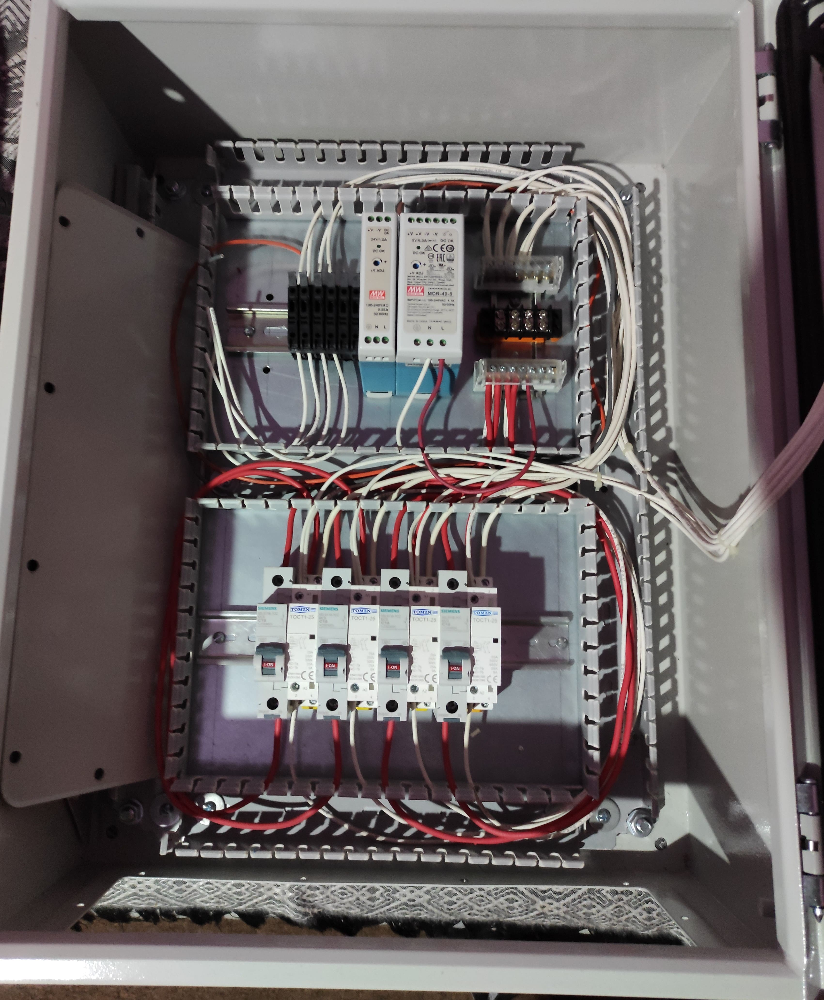
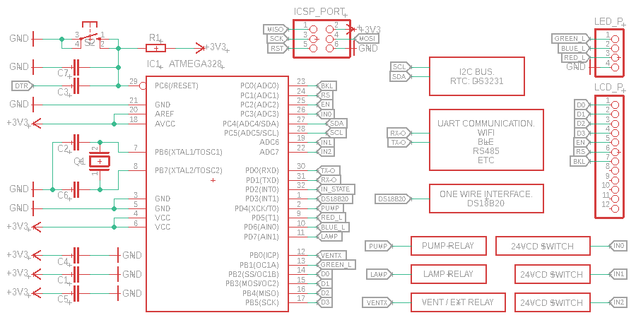

# Hardware

Tarjeta de control, mapa de pines, periféricos y instalación eléctrica.

El proyecto pasó por dos generaciones de hardware. La **actual** usa un ESP32-C3; la **original** un ATmega328P. Este documento cubre ambas, porque parte del diseño eléctrico (SSR, contactores, gabinete) se conserva.

---

## Contenido

- [Generaciones](#generaciones)
- [Mapa de pines (ESP32-C3)](#mapa-de-pines-esp32-c3)
- [Control de potencia PWM](#control-de-potencia-pwm)
- [Temporización con RTC](#temporización-con-rtc)
- [Salidas digitales SSR](#salidas-digitales-ssr)
- [Conectividad](#conectividad)
- [Instalación eléctrica](#instalación-eléctrica)
- [Tarjeta original (ATmega328P)](#tarjeta-original-atmega328p)

---

## Generaciones

| | Original | Actual |
|---|---|---|
| MCU | ATmega328P (8 bits, 32 KB flash, 1 KB EEPROM) | ESP32-C3 (RISC-V, 1 núcleo @160 MHz) |
| Conectividad | BLE por UART | Wi-Fi nativo (AP + STA) |
| RTC | DS1307 | DS3231 (compensado por temperatura) |
| Interfaz de usuario | LCD 20×4 previsto + app BLE | Portal captivo servido desde flash |
| Actuadores | 3 salidas digitales → SSR AQH2213 → contactores | 2 canales PWM + 3 salidas digitales |
| Persistencia | EEPROM | NVS (Preferences) |

El salto a ESP32-C3 se hizo para servir un portal web completo desde el propio microcontrolador: elimina la app intermedia y la dependencia de un dispositivo con BLE.

---

## Mapa de pines (ESP32-C3)

Definido en `ESP32_controller/Constants.h`.

| Componente | GPIO | Tipo | Notas |
|---|---|---|---|
| LED blanco | 0 | Digital | Lógica invertida (`LOW` = encendido) |
| LED azul | 1 | PWM canal 1 | 0–100 % desde el portal |
| LED rojo | 2 | PWM canal 2 | 0–100 % desde el portal |
| Buzzer | 3 | Digital | Señalización sonora (actualmente comentado en el firmware) |
| Ventilador / extractor | 7 | Relé | Lógica invertida |
| Bomba de agua | 10 | Relé | Lógica invertida |
| RTC DS3231 | I²C `0x68` | — | Bus `Wire`, para el scheduling |

**Lógica invertida:** los relés y el LED blanco se activan con `LOW`. En el arranque el constructor de `Plant` escribe `HIGH` en todas esas salidas para que ningún actuador arranque energizado antes de leer la configuración.

**Un solo canal digital para el blanco:** el blanco no tiene PWM asignado, así que solo admite ON/OFF. El portal envía `0` o `1` y el firmware evalúa `> 0`. Los espectros azul y rojo sí son regulables, que es donde la granularidad importa para el PAR.

---

## Control de potencia PWM

La modulación por ancho de pulso se usa aquí para regular la intensidad de cada canal LED de forma independiente, permitiendo adaptar el espectro a la etapa del cultivo — más azul en vegetativo, más rojo en floración.

| Parámetro | Valor |
|---|---|
| Frecuencia | 1 kHz |
| Resolución | 8 bits (duty 0–255) |
| Canales | 2 (azul, rojo) |

Los valores viajan del portal al firmware como **porcentaje 0–100** y se escalan internamente con `map(valor, 0, 100, 0, 255)`. Se eligió exponer porcentaje en la API para que el contrato no dependa de la resolución del PWM: si se sube a 10 bits, el frontend no cambia.

---

## Temporización con RTC

Para temporizar el encendido y apagado de los equipos se usa un RTC por I²C. La versión original usó un [DS1307](https://datasheets.maximintegrated.com/en/ds/DS1307.pdf); la actual un **DS3231**, que integra compensación por temperatura y deriva mucho menos.

El firmware lee el RTC una vez por segundo desde `loop()` (único punto de I²C periódico, para no compartir el bus `Wire` con otras tareas) y con esa lectura decide qué salidas deben estar activas.

La hora **no** se configura con botones: se sincroniza desde el navegador del usuario en el `POST /newparams`, que incluye fecha y hora completas. El primer `/newparams` con fecha válida ancla `cropStart` en NVS, y a partir de ahí la edad del cultivo se **deriva** del calendario en vez de contarse, de modo que el cultivo sigue envejeciendo aunque el equipo estuviera apagado.

<table align="center">
  <tr>
    <th>Diagrama típico de conexión.</th>
    <th>Diagrama de conexión final.</th>
  </tr>
  <tr>
    <th></th>
    <th></th>
  </tr>
</table>

---

## Salidas digitales SSR

En la versión original se ocuparon 3 salidas digitales para la activación de los dispositivos (lámpara, bomba de agua y ventilador/extractor). Las salidas del MCU estaban conectadas individualmente a un SSR [AQH2213](https://b2b-api.panasonic.eu/file_stream/pids/fileversion/2787) con el circuito de protección que sugiere el fabricante para cargas inductivas, como la bobina de los contactores.

<table align="center">
  <tr>
    <th>Diagrama típico de conexión.</th>
    <th>Diagrama de conexión final.</th>
  </tr>
  <tr>
    <th></th>
    <th></th>
  </tr>
</table>

---

## Conectividad

La versión original usaba la interfaz USART para comunicación BLE, con la que se actualizaban las variables del cultivo de forma inalámbrica.

La actual aprovecha el Wi-Fi integrado del ESP32-C3 en **modo AP+STA**:

- **AP** (`SmartPlant`, WPA2-PSK): sirve el portal captivo. Siempre arriba.
- **STA**: se conecta a la red del usuario, solo si hay credenciales guardadas. Habilita telemetría y OTA a futuro.

Hay una sola radio, así que AP y STA comparten canal. Dos detalles que costaron depuración y quedan documentados en el firmware:

1. El modo dual se fija **explícitamente** con `WiFi.mode(WIFI_AP_STA)` antes de crear el SoftAP, para que `WiFi.begin()` del STA no reconfigure el modo por debajo.
2. Hay que **desactivar el modem-sleep** con `WiFi.setSleep(false)`. Con el STA habilitado, el ESP32 duerme la radio según el ciclo del STA (`WIFI_PS_MIN_MODEM` por defecto), lo que deja al SoftAP sin responder y el portal no carga.

---

## Instalación eléctrica

Instalación propuesta para la conexión de los actuadores al gabinete de control. Las salidas del microcontrolador no accionan las cargas directamente: pasan por SSR y de ahí a las bobinas de los contactores, que son los que conmutan la potencia en CA.

La selección de contactores, los diagramas eléctricos y la conexión final se documentarán conforme avance la implementación en hardware de la versión actual.

---

## Tarjeta original (ATmega328P)

El proyecto arrancó actualizando un circuito previamente construido con un [PIC16F1827](https://www.microchip.com/en-us/product/PIC16F1827). El mayor número de pines del [ATmega328P](https://ww1.microchip.com/downloads/en/DeviceDoc/ATmega48A-PA-88A-PA-168A-PA-328-P-DS-DS40002061B.pdf) permitió agregar funcionalidad, como desplegar información en un LCD de 20×4.

Se usó el bootloader de Arduino UNO. Características del MCU aprovechadas: I²C para el RTC, UART para el módulo BLE, salidas PWM y un bloque de salidas digitales para los actuadores.

<table align="center">
  <tr>
    <th>&emsp;&emsp;Vista superior.&emsp;&emsp;</th>
    <th>&emsp;&emsp;Vista inferior.&emsp;&emsp;</th>
    <th>&emsp;&emsp;Tarjeta electrónica.&emsp;&emsp;</th>
  </tr>
</table>

  &emsp;
  &emsp;
  

Esquemático de la tarjeta, con el bus I²C del RTC, la UART para el módulo inalámbrico, la interfaz one-wire para el DS18B20 y los relés de bomba, lámpara y ventilación:

### Medición de temperatura (DS18B20)

Contemplada en el diseño original y visible en el esquemático, pero **no implementada** en el firmware actual. Medir la temperatura del área de cultivo es una labor preventiva: conocer su comportamiento dentro de ciertos rangos ayuda a anticipar problemas. Queda para una futura actualización de hardware que además pueda ejecutar acciones correctivas.

Los archivos de diseño de la tarjeta actual están en [`ESP32_Board/`](../ESP32_Board) (KiCad).
