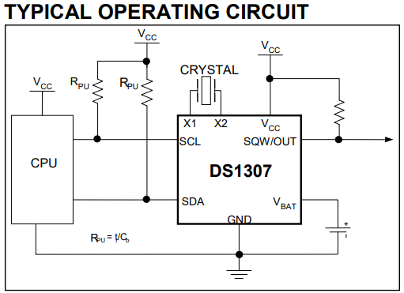
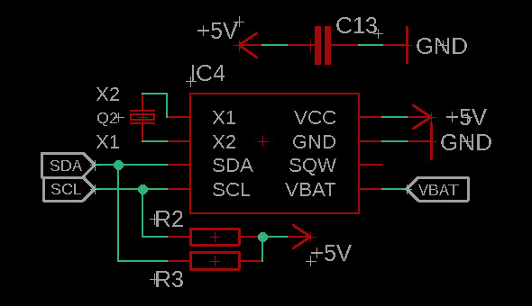
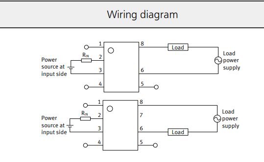
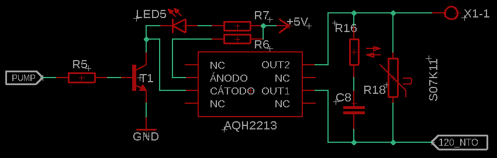
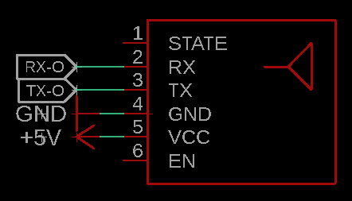
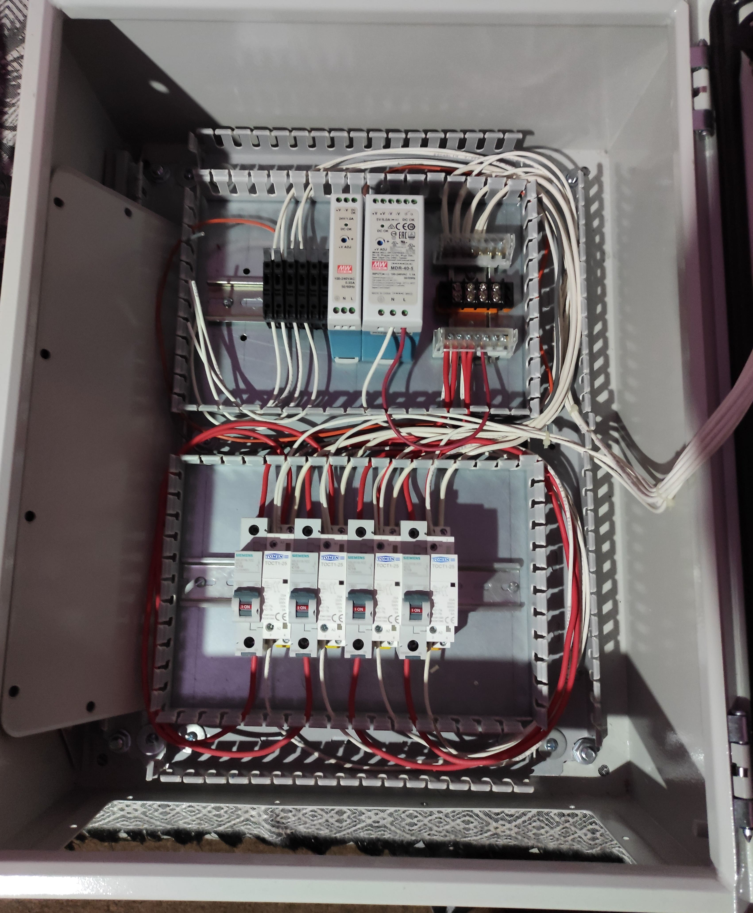

# Hardware

Tarjeta de control, mapa de pines, periféricos y instalación eléctrica.

El controlador es un **ESP32-C3** (RISC-V, 1 núcleo @160 MHz) con Wi-Fi nativo, que sirve el portal captivo desde su propia flash. El diseño eléctrico de potencia (SSR, contactores, gabinete) conmuta las cargas en CA.

---

## Contenido

- [Mapa de pines (ESP32-C3)](#mapa-de-pines-esp32-c3)
- [Control de potencia PWM](#control-de-potencia-pwm)
- [Temporización con RTC](#temporización-con-rtc)
- [Salidas digitales SSR](#salidas-digitales-ssr)
- [Etapa de potencia: acoplamiento control ↔ potencia](#etapa-de-potencia-acoplamiento-control--potencia)
- [Conectividad](#conectividad)
- [Instalación eléctrica](#instalación-eléctrica)
- [Medición de temperatura (DS18B20)](#medición-de-temperatura-ds18b20)

---

## Mapa de pines (ESP32-C3)

Definido en `ESP32_controller/Constants.h`.

| Componente | GPIO | Tipo | Notas |
|---|---|---|---|
| LED blanco | 0 | Digital | Lógica directa (`HIGH` = encendido) |
| LED azul | 1 | PWM canal 1 | 0–100 % desde el portal |
| LED rojo | 2 | PWM canal 2 | 0–100 % desde el portal |
| Buzzer | 3 | Digital | Señalización sonora no bloqueante (ver [vocabulario de pitidos](#vocabulario-de-pitidos)) |
| Ventilador / extractor | 7 | Relé | Lógica directa |
| Bomba de agua | 10 | Relé | Lógica directa |
| RTC DS3231 | I²C `0x68` | — | Bus `Wire`, para el scheduling |

**Polaridad centralizada:** el nivel que enciende vive en **un solo sitio**, las constantes `deviceOn`/`deviceOff` de `Constants.h`, hoy `HIGH`/`LOW` (lógica directa). Si se cambia a módulos de relé activos en bajo, basta intercambiar esas dos líneas y todo el firmware queda coherente.

**Estado inicial seguro:** `Plant::begin()` llama a `allDevicesOff()` antes de leer cualquier configuración, para que ningún actuador arranque energizado.

**La inicialización de hardware NO va en el constructor:** `Plant planta;` es un objeto global, así que su constructor corre durante la inicialización estática de C++, antes de que el framework de Arduino termine de preparar los periféricos. Configurar GPIO o LEDC ahí puede fallar en silencio o quedar sobrescrito, dejando un pin como entrada flotante en lugar de salida firme; el síntoma típico es un relé o LED con **brillo débil** que no conmuta bien. Por eso `pinMode`, `ledcAttachChannel` y el estado inicial se hacen en `begin()`, invocado desde `setup()`.

**Un solo canal digital para el blanco:** el blanco no tiene PWM asignado, así que solo admite ON/OFF. El portal envía `0` o `1` y el firmware evalúa `> 0`. Los espectros azul y rojo sí son regulables, que es donde la granularidad importa para el PAR.

---

## Control de potencia PWM

La modulación por ancho de pulso se usa aquí para regular la intensidad de cada canal LED de forma independiente, permitiendo adaptar el espectro a la etapa del cultivo — más azul en vegetativo, más rojo en floración.

| Parámetro | Valor |
|---|---|
| Frecuencia | 1 kHz |
| Resolución | 8 bits (duty 0–255) |
| Canales | 2 (azul, rojo) |

Los valores viajan del portal al firmware como **porcentaje 0–100** y se escalan internamente con `map(valor, 0, 100, 0, 255)`. Se eligió exponer porcentaje en la API para que el contrato no dependa de la resolución del PWM: si se sube a 10 bits, el frontend no cambia.

---

## Temporización con RTC

Para temporizar el encendido y apagado de los equipos se usa un **DS3231** por I²C (dirección `0x68`), compensado por temperatura y de baja deriva.

El firmware lee el RTC una vez por segundo desde `loop()` (único punto de I²C periódico, para no compartir el bus `Wire` con otras tareas) y con esa lectura decide qué salidas deben estar activas.

La hora **no** se configura con botones: se sincroniza desde el navegador del usuario en el `POST /newparams`, que incluye fecha y hora completas. El primer `/newparams` con fecha válida ancla `cropStart` en NVS, y a partir de ahí la edad del cultivo se **deriva** del calendario en vez de contarse, de modo que el cultivo sigue envejeciendo aunque el equipo estuviera apagado.

<table align="center">
  <tr>
    <th>Diagrama típico de conexión.</th>
    <th>Diagrama de conexión final.</th>
  </tr>
  <tr>
    <th></th>
    <th></th>
  </tr>
</table>

---

## Salidas digitales SSR

> **En revisión.** El SSR AQH2213 fue la elección de la **primera iteración** (por
> disponibilidad local en ese momento). Hoy es difícil de conseguir, así que la etapa de
> acoplamiento está **en rediseño** hacia MOSFET lógico + contactor con bobina de CD; ver
> [Etapa de potencia](#etapa-de-potencia-acoplamiento-control--potencia). Esta sección se
> conserva como referencia de la iteración previa.

Tres salidas digitales accionan los dispositivos (lámpara, bomba de agua y ventilador/extractor). Cada salida del MCU va a un SSR [AQH2213](https://b2b-api.panasonic.eu/file_stream/pids/fileversion/2787) con el circuito de protección que sugiere el fabricante para cargas inductivas, como la bobina de los contactores.

<table align="center">
  <tr>
    <th>Diagrama típico de conexión.</th>
    <th>Diagrama de conexión final.</th>
  </tr>
  <tr>
    <th><a href="https://b2b-api.panasonic.eu/file_stream/pids/fileversion/2787"></a></th>
    <th></th>
  </tr>
</table>

---

## Etapa de potencia: acoplamiento control ↔ potencia

Cómo se acopla la lógica del ESP32-C3 (3.3 V) con la potencia. Esta sección recoge las
decisiones de rediseño que sustituyen al SSR AQH2213 de la primera iteración.

### Decisiones tomadas

| Tema | Decisión | Por qué |
|---|---|---|
| **Fuente única** | **24 VCD** | A 120 W, 24 V tira ~5 A vs ~10 A a 12 V → mitad de corriente, ¼ de pérdidas (I²R), pistas y conectores más chicos, menos calor. A >60 W las fuentes de 24 V son tan comunes como las de 12 V. Una sola fuente alimenta LEDs, bobinas de contactor y (vía buck) el MCU. |
| **Dimensionado LED** | 60–120 W para 1–2 m², relación **1:5 azul:rojo con azul predominante** | Azul ≈ 100 W (~4.2 A @ 24 V, canal fuerte); rojo ≈ 20 W (~0.85 A). El hardware se dimensiona al **peor caso: cada canal al 100 %**. |
| **Salidas digitales (vent/bomba/blanco)** | **Contactor con bobina de CD (24 V)** accionado por **MOSFET lógico + diodo flyback** | Con bobina CD y tierra común NO hace falta optoacoplador: el **contactor es la barrera de aislamiento** hacia la CA. Más simple y barato que SSR/triac u opto+transistor. |
| **PWM LED (azul, rojo)** | **MOSFET lógico N-channel directo** (sin opto) | A 1 kHz un optoacoplador común (PC817) deforma la señal. El MOSFET lógico conmuta directo desde 3.3 V. |
| **MCU 3.3 V** | **Buck 24→5 V (→3.3 V)**, no lineal | Un lineal 24→3.3 disiparía demasiado; se usa un convertidor conmutado (p. ej. MP1584). |

### Pendiente de definir

- **Tipo de arreglo LED:** *voltaje constante (24 V)* vs *driver de corriente constante*.
  Decide la topología del canal PWM (ver abajo). **Mientras no se defina, el MOSFET exacto
  del canal azul queda tentativo.**
- **Bobina del contactor:** confirmar que se consiguen contactores con **bobina 24 VCD** y su
  consumo (corriente de retención y pico de arranque / inrush).

### Componentes propuestos (todos comunes / JLCPCB Basic)

| Función | Componente | Notas |
|---|---|---|
| MOSFET canal PWM (azul/rojo) | **IRLZ44N** (TO-220) o **AOD4184** (DPAK, SMD) | Logic-level, margen de V y RDS(on) para el canal azul ~4.2 A @ 24 V. El AO3400A (30 V, ~5.7 A) se queda **justo** a 24 V y a 3.3 V de gate su RDS(on) sube: solo para cargas pequeñas. |
| MOSFET bobina de contactor | **AO3400A** (SOT-23) | La bobina tira poco (<0.2 A típico); aquí el AO3400A sobra. |
| Diodo flyback (bobina CD) | **SS14** (Schottky SMD) o **1N4007** | **Obligatorio** en antiparalelo con la bobina CD: absorbe el pico inductivo (V=−L·di/dt) al cortar. |
| Resistencia de gate | **100 Ω** | En serie GPIO→gate. |
| Pull-down de gate | **100 kΩ** | Gate→GND. Mantiene el actuador apagado durante el boot del C3 (sus GPIO quedan indefinidos antes de que corra el firmware). |
| Convertidor MCU | Buck **24 V → 5 V** (MP1584 o equiv.) | De ahí al regulador 3.3 V. |
| Fuente | **24 VCD, 150 W** (o 100 W si tope 60 W) | ~125 % de la carga máxima. |
| LED indicador de salida | **LED + 4.7 kΩ** | Uno por salida digital, en paralelo con la bobina del contactor (~5 mA @ 24 V). Indica salida realmente energizada. |
| LED indicador de sistema | **LED + 680 Ω** | "24 V presente" en la fuente y, opcional, "3.3 V OK" tras el buck (~2 mA @ 3.3–5 V). |
| Buzzer | **Activo magnético 5 V** (HYDZ 12 mm, DIP) | 2.4 kHz fijo, ~30 mA, 85 dB. Alimentado a 5 V, conmutado por MOSFET pequeño + flyback (ver esquemático). Control no bloqueante en firmware (`buzzerBeep`/`buzzerUpdate`). |

### Esquemático — canal PWM de LED (voltaje constante)

Aplica si las tiras/arreglos son de **voltaje constante a 24 V**. Un canal por color
(GPIO 1 = azul, GPIO 2 = rojo):

```
            +24 V
              │
          [ ARREGLO LED ]        (azul o rojo)
              │
              │  Drain
 GPIO ──[100Ω]──┤ IRLZ44N / AOD4184 (N-ch, logic-level)
   │          │  Source
 [100k]       │
   │         GND
  GND
```

- `GPIO` = pin PWM (1 kHz, 8 bits). `100Ω` protege el pin; `100k` a GND mantiene el MOSFET
  apagado en el arranque.
- Si el arreglo lleva **driver de corriente constante**, el PWM NO va a este MOSFET: va a la
  **entrada de dimming (PWM/0–10 V)** del driver. Topología distinta — a definir.
- **Sin LED indicador dedicado** en los canales PWM a propósito: el propio arreglo LED ya es el
  indicador visual, y un LED colgado del PWM parpadearía a 1 kHz (brillo según el duty),
  confuso como indicador de estado.

> **Nota de pines (strapping):** el PWM rojo está en **GPIO 2**, que en el ESP32-C3 es
> *strapping pin* de boot. Un pull-down de 100 kΩ (alta impedancia) no suele afectar el
> arranque, pero conviene verificarlo; si da problemas, mover ese canal a un GPIO no-strapping.

### Esquemático — salida digital (contactor con bobina CD)

Aplica a ventilador, bomba y lámpara blanca (GPIO 7, 10, 0). El contactor conmuta la **CA**
de la carga; su bobina es de **24 VCD**:

```
            +24 V
              │
         [ BOBINA CONTACTOR 24 VCD ]
              │        ▲
              ├────────┤ cátodo   SS14 / 1N4007   (flyback, antiparalelo)
              │        ▼ ánodo
              │
              ├──[4.7k]──▶|── (LED indicador: salida activa)
              │
              │  Drain
 GPIO ──[100Ω]──┤ AO3400A
   │          │  Source
 [100k]       │
   │         GND
  GND

   (contactos del contactor) ── conmutan la carga en CA (120/240 V)
```

- El **flyback** va en antiparalelo con la bobina (cátodo a +24 V, ánodo al drain): sin él, el
  pico inductivo al apagar destruye el MOSFET.
- El **LED indicador** (en serie con `4.7 kΩ`) va **en paralelo con la bobina**, así enciende
  solo cuando la bobina está realmente energizada: confirma el camino completo
  GPIO→MOSFET→bobina, no solo lo que pide el firmware. El LED+R **no sustituye al flyback**;
  son elementos distintos. A ~5 mA: `R = (24−2)/0.005 ≈ 4.7 kΩ`, 1/4 W sobra.
- El **aislamiento hacia la CA lo da el contactor** (sus contactos separan la red de la
  electrónica de control). Por eso no se usa optoacoplador en la bobina de bajo voltaje.
- Si se quisiera una barrera extra por ruido de motores/bomba, se puede dejar **huella
  opcional de opto** y poblarla solo si hace falta — pero el diseño base va **sin** opto.

### Esquemático — buzzer (GPIO 3)

Buzzer **activo** (oscilador integrado: suena con solo aplicarle DC, tono fijo 2.4 kHz).
Control ON/OFF, igual que una salida digital. GPIO 3 ya está reservado para esto.

```
            +5 V  (riel del buck)
              │
          [ BUZZER activo 5 V ]
              │
              ├──▶|── 1N4148   (flyback: es magnético = inductivo)
              │
              │  Drain
 GPIO 3 ─[100Ω]─┤ 2N7002 / AO3400A
   │          │  Source
 [100k]       │
   │         GND
  GND
```

- **No se conecta directo al GPIO**: a 5 V y ~30 mA, el pin del C3 (3.3 V) no debe manejarlo
  directo. El MOSFET conmuta los 5 V; el GPIO 3 solo controla el gate (resuelve a la vez la
  corriente y el desajuste 3.3 V/5 V).
- **Flyback 1N4148** en antiparalelo: el buzzer magnético es inductivo.
- `100 Ω` gate + `100 kΩ` pull-down → mismo patrón que el resto; buzzer callado en el boot.
- A 3.3 V sonaría más débil (su óptimo es 5 V), por eso se alimenta del riel de 5 V.
- **Firmware:** el control del buzzer está implementado como salida digital no bloqueante
  (`pinMode` en `begin()`, máquina de estados `buzzerBeep`/`buzzerUpdate`). Ver el vocabulario
  de pitidos abajo.

#### Vocabulario de pitidos

El sonido comunica **qué** pasó, no solo "algo pasó". Los patrones se eligieron para que un
error no se confunda con una confirmación. Implementado con la máquina no bloqueante
(`buzzerBeep`/`buzzerUpdate`), salvo los eventos que reinician el equipo o son caminos de
error, que suenan síncronos en su handler (ver `ESP32_controller.ino`). Conteos en
`Constants.h` (`buzzerBeeps*`).

| Evento | Patrón | Disparo | Bloqueante |
|---|---|---|---|
| **Sistema listo** (boot) | 1 corto | fin de `setup()` | No |
| **Arranque sin RTC fiable** | 4 cortos | fin de `setup()` si `!isRtcValid()` | No |
| **Parámetros aplicados** | 3 cortos (330/330) | `/newparams` → `STATUS_OK` | No |
| **Login fallido / bloqueado** | 2 cortos | `MISMATCH_CREDENTIALS` / `TOO_MANY_ATTEMPTS` | No |
| **OTA correcta** | 1 largo (~600 ms) | `/otaupdate` OK, antes del reinicio | Sí (reinicia) |
| **OTA fallida** | 2 cortos | error 401/403/500 de `/otaupdate` | Sí (breve) |
| **Reset de fábrica** | 1 largo (~600 ms) | `HARD_RESET`, antes del reinicio | Sí (reinicia) |

**Deliberadamente SIN sonido:** las conmutaciones rutinarias de riego/luz/ventilación (muy
frecuentes, serían molestas) y el polling de Wi-Fi. El inicio de OTA tampoco pita, para no
interferir con la escritura del primer bloque en flash. El buzzer se reserva para **eventos de
usuario y de seguridad**.

### Diagrama de bloques

```
                         Fuente 24 VCD  ──[680Ω]──▶|  LED "24 V"
          ┌──────────────────┼───────────────────────────┐
          │                  │                            │
      buck 24→5→3.3     arreglos LED (24 V)        bobinas contactor (24 VCD)
          │             azul / rojo                  vent · bomba · blanco
       ESP32-C3            ▲   ▲                         ▲   ▲   ▲
          │  PWM 1 kHz ────┘   │                         │   │   │  cada bobina:
          │  (GPIO 1,2)        │        GPIO 7,10,0 ──────┘   │   │  ∥ LED+4.7k (indicador)
          └── MOSFET lógico ───┴──── MOSFET lógico + flyback ─┴───┘
                                                   │
                                            contactos CA → cargas 120/240 V
```

Los canales PWM no llevan LED indicador dedicado (el arreglo LED ya es su indicador).

---

El ESP32-C3 aprovecha su Wi-Fi integrado en **modo AP+STA**:

- **AP** (`SmartPlant`, WPA2-PSK): sirve el portal captivo. Siempre arriba.
- **STA**: se conecta a la red del usuario, solo si hay credenciales guardadas. Habilita telemetría y OTA a futuro.

Hay una sola radio, así que AP y STA comparten canal. Dos detalles que costaron depuración y quedan documentados en el firmware:

1. El modo dual se fija **explícitamente** con `WiFi.mode(WIFI_AP_STA)` antes de crear el SoftAP, para que `WiFi.begin()` del STA no reconfigure el modo por debajo.
2. Hay que **desactivar el modem-sleep** con `WiFi.setSleep(false)`. Con el STA habilitado, el ESP32 duerme la radio según el ciclo del STA (`WIFI_PS_MIN_MODEM` por defecto), lo que deja al SoftAP sin responder y el portal no carga.

<div align="center"></div>

---

## Instalación eléctrica

Instalación propuesta para la conexión de los actuadores al gabinete de control. Las salidas del microcontrolador no accionan las cargas directamente: pasan por la [etapa de potencia](#etapa-de-potencia-acoplamiento-control--potencia) (MOSFET lógico) y de ahí a las bobinas de los contactores, que son los que conmutan la potencia en CA.

<div align="center"></div>

La selección de contactores, los diagramas eléctricos y la conexión final se documentarán conforme avance la implementación en hardware.

---

## Medición de temperatura (DS18B20)

**Planeada, aún no implementada** en el firmware. Medir la temperatura del área de cultivo es una labor preventiva: conocer su comportamiento dentro de ciertos rangos ayuda a anticipar problemas. Queda para una futura actualización que además pueda ejecutar acciones correctivas.

Los archivos de diseño de la tarjeta están en [`ESP32_Board/`](../ESP32_Board) (KiCad).
