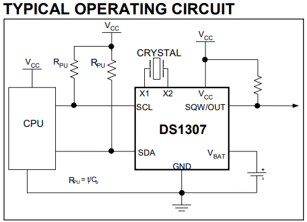
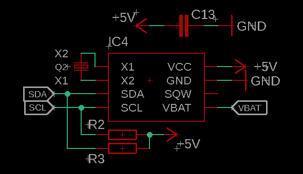
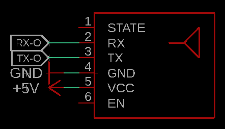
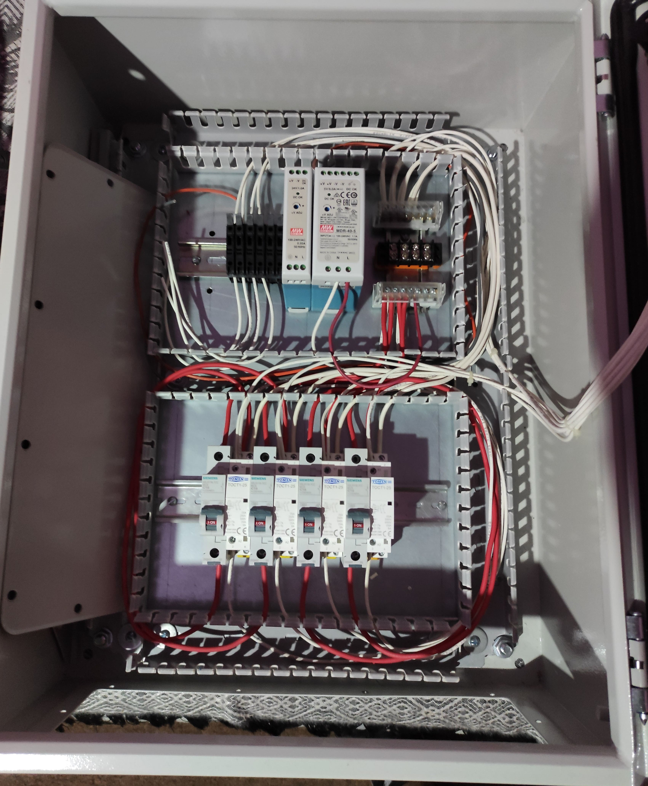

# Hardware

Tarjeta de control, mapa de pines, periféricos y instalación eléctrica.

El controlador es un **ESP32-C3** (RISC-V, 1 núcleo @160 MHz) con Wi-Fi nativo, que sirve el portal captivo desde su propia flash. El diseño eléctrico de potencia (MOSFET, contactores, gabinete) conmuta las cargas en CA.

---

## Contenido

- [Mapa de pines (ESP32-C3)](#mapa-de-pines-esp32-c3)
- [Control de potencia PWM](#control-de-potencia-pwm)
- [Temporización con RTC](#temporización-con-rtc)
- [Etapa de potencia: acoplamiento control ↔ potencia](#etapa-de-potencia-acoplamiento-control--potencia)
- [Conectividad](#conectividad)
- [Instalación eléctrica](#instalación-eléctrica)
- [Medición de temperatura (DS18B20)](#medición-de-temperatura-ds18b20)

---

## Mapa de pines (ESP32-C3)

Definido en `ESP32_controller/Constants.h`.

| Componente | GPIO | Tipo | Notas |
|---|---|---|---|
| Lámpara | 0 | Digital | Control principal de iluminación, ON/OFF. Activa en bajo (`LOW` = encendido) |
| LED azul | 1 | PWM canal 1 | 0–100 % desde el portal |
| LED rojo | 2 | PWM canal 2 | 0–100 % desde el portal |
| Buzzer | 3 | Digital | Señalización sonora no bloqueante. Activo en bajo (`LOW` = suena). Ver [vocabulario de pitidos](#vocabulario-de-pitidos) y [polaridad](#polaridad-de-las-salidas-onoff-activa-en-bajo) |
| Ventilador / extractor | 7 | Contactor | Activo en bajo (`LOW` = encendido). Ver [polaridad](#polaridad-de-las-salidas-onoff-activa-en-bajo) |
| Bomba de agua | 10 | Contactor | Activo en bajo (`LOW` = encendido). Ver [polaridad](#polaridad-de-las-salidas-onoff-activa-en-bajo) |
| I²C SDA | 8 | I²C | Datos del bus I²C (DS3231) |
| I²C SCL | 9 | I²C | Reloj del bus I²C (DS3231) |
| RTC DS3231 | I²C `0x68` | — | Reloj externo para el scheduling (bus I²C en GPIO 8/9) |

**Polaridad centralizada:** el nivel que enciende vive en **un solo sitio**, las constantes `deviceOn`/`deviceOff` de `Constants.h`, hoy `LOW`/`HIGH` (**activo en bajo**: el pin en bajo enciende). Antes eran `HIGH`/`LOW` (lógica directa); el cambio llegó con la versión 1.0.1 del firmware Arduino. Si el hardware fuese activo en alto, basta intercambiar esas dos líneas y todo el firmware queda coherente. Las usan las cuatro salidas ON/OFF (lámpara, bomba, ventilador **y buzzer**); los canales PWM azul y rojo no dependen de ellas.

**Estado inicial seguro:** `Plant::begin()` llama a `allDevicesOff()` antes de leer cualquier configuración, para que ningún actuador arranque energizado. Con la polaridad activa en bajo, "apagado" es nivel **alto**. Durante el reset y el arranque del chip los GPIO están en alta impedancia y los circuitos están pensados para quedar apagados en ese estado (ver [polaridad](#polaridad-de-las-salidas-onoff-activa-en-bajo)). Lo que el firmware no garantiza es el instante dentro de `begin()` entre el `pinMode(OUTPUT)` de un pin y su primera escritura de `deviceOff`: el registro de salida arranca en 0 (nivel de "encendido"), así que el pin puede quedar brevemente en bajo; no se ha medido.

**La inicialización de hardware NO va en el constructor:** `Plant planta;` es un objeto global, así que su constructor corre durante la inicialización estática de C++, antes de que el framework de Arduino termine de preparar los periféricos. Configurar GPIO o LEDC ahí puede fallar en silencio o quedar sobrescrito, dejando un pin como entrada flotante en lugar de salida firme; el síntoma típico es un relé o LED con **brillo débil** que no conmuta bien. Por eso `pinMode`, `ledcAttachChannel` y el estado inicial se hacen en `begin()`, invocado desde `setup()`.

**Un solo canal digital para la lámpara:** la lámpara no tiene PWM asignado, así que solo admite ON/OFF; por eso sirve con lámparas de cultivo comerciales que se manejen con un control ON/OFF simple. Los canales PWM azul y rojo son opcionales, para quien quiera controlar esos espectros con más precisión. El portal envía `0` o `1` y el firmware evalúa `> 0`. Los espectros azul y rojo sí son regulables, que es donde la granularidad importa para el PAR.

### Polaridad de las salidas ON/OFF (activa en bajo)

Desde la versión 1.0.1 del firmware, las cuatro salidas ON/OFF (lámpara, bomba, ventilador y
buzzer) son **activas en bajo**: el GPIO en **bajo** (`deviceOn = LOW`) enciende y en **alto**
apaga. Los canales PWM azul y rojo no dependen de esto (duty alto = más luz).

| Salida | Circuito | Estado |
|---|---|---|
| Lámpara, bomba y ventilador (GPIO 0, 10, 7) — lado de control | Opto PC817 y LED indicador en **sumidero**: `+3.3 V → ánodo`, `cátodo → R → GPIO` | **Verificado en la placa**: el LED indicador enciende con el GPIO en bajo |
| Lámpara, bomba y ventilador — lado de potencia | Fototransistor como seguidor de emisor + Zener de 10 V + AO3400A (ver [esquemático](#esquemático--salida-digital-opto--mosfet--contactor)) | **Diseño, aún sin montar** |
| Buzzer (GPIO 3) | TMB12A05 con dos AO3400A (inversor + interruptor) | **Diseño recomendado, aún sin montar** (ver [esquemático](#esquemático--buzzer-gpio-3)) |

Con el GPIO en alta impedancia (reset y arranque), las salidas con opto quedan apagadas solas:
sin camino de retorno no circula corriente por el LED del opto, así que no hace falta
pull-down.

---

## Control de potencia PWM

La modulación por ancho de pulso se usa aquí para regular la intensidad de cada canal LED de forma independiente, permitiendo adaptar el espectro a la etapa del cultivo — más azul en vegetativo, más rojo en floración. Es una función **opcional**, pensada para usuarios con más experiencia: la iluminación principal es la lámpara ON/OFF (GPIO 0), que no usa PWM.

| Parámetro | Valor |
|---|---|
| Frecuencia | 1 kHz |
| Resolución | 8 bits (duty 0–255) |
| Canales | 2 (azul, rojo) |

Los valores viajan del portal al firmware como **porcentaje 0–100** y se escalan internamente con `map(valor, 0, 100, 0, 255)`. Se eligió exponer porcentaje en la API para que el contrato no dependa de la resolución del PWM: si se sube a 10 bits, el frontend no cambia.

---

## Temporización con RTC

Para temporizar el encendido y apagado de los equipos se usa un **DS3231** por I²C (dirección `0x68`), compensado por temperatura y de baja deriva.

El firmware lee el RTC una vez por segundo desde `loop()` (único punto de I²C periódico, para no compartir el bus `Wire` con otras tareas) y con esa lectura decide qué salidas deben estar activas.

La hora **no** se configura con botones: se sincroniza desde el navegador del usuario en el `POST /newparams`, que incluye fecha y hora completas. El primer `/newparams` con fecha válida ancla `cropStart` en NVS, y a partir de ahí la edad del cultivo se **deriva** del calendario en vez de contarse, de modo que el cultivo sigue envejeciendo aunque el equipo estuviera apagado.

<table align="center">
  <tr>
    <th>Diagrama típico de conexión.</th>
    <th>Diagrama de conexión final.</th>
  </tr>
  <tr>
    <th></th>
    <th></th>
  </tr>
</table>

---

## Etapa de potencia: acoplamiento control ↔ potencia

Cómo se acopla la lógica del ESP32-C3 (3.3 V) con la potencia. Esta sección recoge las
decisiones de rediseño que sustituyen al SSR AQH2213 de la primera iteración.

### Decisiones tomadas

| Tema | Decisión | Por qué |
|---|---|---|
| **Fuente única** | **24 VCD** | A 120 W, 24 V tira ~5 A vs ~10 A a 12 V → mitad de corriente, ¼ de pérdidas (I²R), pistas y conectores más chicos, menos calor. A >60 W las fuentes de 24 V son tan comunes como las de 12 V. Una sola fuente alimenta LEDs, bobinas de contactor y (vía buck) el MCU. |
| **Dimensionado LED (canales PWM, opcional)** | Referencia de diseño: 60–120 W para 1–2 m², relación **5:1 azul:rojo, con azul predominante** | Azul ≈ 100 W (~4.2 A @ 24 V, canal fuerte); rojo ≈ 20 W (~0.85 A). Los canales se dimensionan al **peor caso: cada canal al 100 %**. Es solo una referencia: usar los canales PWM, y con qué potencia de LED, queda **a criterio del usuario**; la iluminación principal es la lámpara ON/OFF (GPIO 0). |
| **Salidas digitales (vent/bomba/lámpara)** | **Opto PC817 en sumidero (activo en bajo) + MOSFET lógico** acciona un **relé/contactor con bobina CD (5/12/24 V, a elección del usuario)**; el fototransistor trabaja como **seguidor de emisor** (no invierte) y un **Zener de 10 V** protege el gate; **flyback** en la bobina y **snubber RC** en los contactos de CA | Aislamiento galvánico entre control (3.3 V) y potencia: el opto separa `GND_control` de `GND_potencia` (jumper opcional para fuente única). Mismo circuito para los tres voltajes de bobina. |
| **PWM LED (azul, rojo)** | **MOSFET lógico N-channel directo** (sin opto) | A 1 kHz un optoacoplador común (PC817) deforma la señal. El MOSFET lógico conmuta directo desde 3.3 V. |
| **MCU 3.3 V** | **Buck 24→5 V (→3.3 V)**, no lineal | Un lineal 24→3.3 disiparía demasiado; se usa un convertidor conmutado (p. ej. MP1584). |

### Pendiente de definir

- **Tipo de arreglo LED:** *voltaje constante (24 V)* vs *driver de corriente constante*.
  Decide la topología del canal PWM (ver abajo). **Mientras no se defina, el MOSFET exacto
  del canal azul queda tentativo.**
- **Bobina del contactor:** confirmar que se consiguen contactores con **bobina 24 VCD** y su
  consumo (corriente de retención y pico de arranque / inrush).

### Componentes propuestos (todos comunes / JLCPCB Basic)

| Función | Componente | Notas |
|---|---|---|
| MOSFET canal PWM (azul/rojo) | **IRLZ44N** (TO-220) o **AOD4184** (DPAK, SMD) | Logic-level, margen de V y RDS(on) para el canal azul ~4.2 A @ 24 V. El AO3400A (30 V, ~5.7 A) se queda **justo** a 24 V y a 3.3 V de gate su RDS(on) sube: solo para cargas pequeñas. |
| MOSFET bobina de contactor | **AO3400A** (SOT-23) | La bobina tira poco (<0.2 A típico); aquí el AO3400A sobra. Lo excita el opto como seguidor de emisor. Su Vgs máximo es **±12 V**, por eso el Zener del gate. |
| Optoacoplador (salidas digitales) | **PC817** (DIP-4 / SOP-4) | Aísla el GPIO (3.3 V) del dominio de potencia (bobina 5/12/24 VCD). **Activo en bajo (sumidero)**: `+3.3 V → ánodo`, `cátodo → R 330Ω → GPIO`; sin pull-down (con el GPIO en alta impedancia, en reset, el opto no conduce: apagado seguro). Salida: fototransistor como **seguidor de emisor** (`colector → +V_bobina`, `emisor → 10 kΩ → gate`). **Tierras separadas** (jumper opcional para fuente única sin aislar). |
| Diodo flyback (bobina) | **SS14** (Schottky SMD) o **1N4007** | **Obligatorio** en antiparalelo con la bobina CD: absorbe el pico inductivo (V=−L·di/dt) al cortar. Igual para 5/12/24 V. |
| Snubber RC (contactos CA) | **100 Ω ≥2 W + 0.1 µF X2 275 VCA** (en serie) | En paralelo con los contactos del relé/contactor / la carga. Protege los contactos del arco al abrir un motor inductivo (≤1 HP, 120 VCA) y reduce EMI. |
| Resistencia serie del gate (lado potencia) | **10 kΩ** emisor→gate | Limita la corriente hacia el Zener (~1.4 mA a 24 V, dentro de lo que entrega el fototransistor) y, con el pull-down, fija ≈ 4.4 V de gate con bobina de 5 V. |
| Pull-down del gate (lado potencia) | **100 kΩ** gate→`GND_potencia` | Descarga el gate y mantiene el MOSFET apagado cuando el opto no conduce. |
| Zener de protección del gate | **BZX84C10** (10 V, SOT-23) | Cátodo al gate, ánodo a `GND_potencia`. Limita Vgs a ~10 V con bobinas de 12/24 V (AO3400A: máx. ±12 V). A 5 V no actúa. |
| Convertidor MCU | Buck **24 V → 5 V** (MP1584 o equiv.) | De ahí al regulador 3.3 V. |
| Fuente | **24 VCD, 150 W** (o 100 W si tope 60 W) | ~125 % de la carga máxima. |
| LED indicador de salida | **LED + 680 Ω** | Uno por salida digital, en el **lado de control**, en sumidero igual que el opto (`+3.3 V → 680 Ω → LED → GPIO`: enciende con el GPIO en bajo, ~2–3 mA @ 3.3 V; **verificado en la placa**). R fija: **independiente del voltaje de bobina** (5/12/24 V). Indica lo que pide el firmware. |
| LED indicador de sistema | **LED + 680 Ω** | "24 V presente" en la fuente y, opcional, "3.3 V OK" tras el buck (~2 mA @ 3.3–5 V). |
| Buzzer | **TMB12A05** (activo, 5 V, 12 mm, DIP) | 2300 ± 300 Hz, ≤ 30 mA, ≥ 85 dB a 10 cm. Alimentado a 5 V, conmutado por **dos AO3400A** (inversor + interruptor, activo en bajo; mismo MOSFET que las bobinas) + flyback 1N4148, desde GPIO 3 (ver esquemático). Control no bloqueante (`buzzerBeep`/`buzzerUpdate`). |

### Esquemático — canal PWM de LED (voltaje constante)

<!-- TODO: reemplazar el diagrama ASCII de abajo por la captura del esquemático real.
     
     NOTA: sección aún no cerrada — el usuario podrá conectar sus propios LEDs/arreglos
     (punto de conexión flexible, como las bobinas). Capturar cuando se fijen límites
     de voltaje/corriente del canal. -->

Aplica si las tiras/arreglos son de **voltaje constante a 24 V**. Un canal por color
(GPIO 1 = azul, GPIO 2 = rojo):

```
            +24 V
              │
          [ ARREGLO LED ]        (azul o rojo)
              │
              │  Drain
 GPIO ──[100Ω]──┤ IRLZ44N / AOD4184 (N-ch, logic-level)
   │          │  Source
 [100k]       │
   │         GND
  GND
```

- `GPIO` = pin PWM (1 kHz, 8 bits). `100Ω` protege el pin; `100k` a GND mantiene el MOSFET
  apagado en el arranque.
- Si el arreglo lleva **driver de corriente constante**, el PWM NO va a este MOSFET: va a la
  **entrada de dimming (PWM/0–10 V)** del driver. Topología distinta — a definir.
- **Sin LED indicador dedicado** en los canales PWM a propósito: el propio arreglo LED ya es el
  indicador visual, y un LED colgado del PWM parpadearía a 1 kHz (brillo según el duty),
  confuso como indicador de estado.

> **Nota de pines (strapping):** en el ESP32-C3 los pines de *strapping* de boot son
> **GPIO 2, 8 y 9**, y el diseño usa los tres: el **PWM rojo (GPIO 2)** y el **bus I²C del
> DS3231 (SDA GPIO 8 / SCL GPIO 9)**.
>
> - **GPIO 9** decide el arranque: en alto al reiniciar, el chip ejecuta el programa; en bajo,
>   entra al bootloader serie y no arranca la aplicación. Tiene un pull-up interno (~45 kΩ), y
>   si el módulo DS3231 trae pull-ups de I²C también lo mantienen en alto. Hay que comprobar
>   que nada del bus lo fuerce a bajo durante el reset.
> - **GPIO 8** solo importa para entrar al bootloader: en arranque normal (GPIO 9 en alto)
>   se ignora. La combinación GPIO 8 = 0 y GPIO 9 = 0 es inválida.
> - **GPIO 2**: un pull-down de 100 kΩ (alta impedancia) no suele afectar el arranque, pero
>   conviene verificarlo (ver "Strapping Pins" en el datasheet del ESP32-C3).
>
> Si alguno da problemas de arranque, reubicar esa señal a un GPIO no-strapping. Esto **no se
> ha verificado en la placa**; la descripción de GPIO 8/9 sale de la documentación de
> Espressif (boot mode selection).

### Esquemático — salida digital (opto + MOSFET + contactor)

<!-- TODO: reemplazar el diagrama ASCII de abajo por la captura del esquemático real.
      -->

> Salida **activa en bajo** (opto en sumidero), verificada en la placa. Ver [Polaridad de las salidas ON/OFF](#polaridad-de-las-salidas-onoff-activa-en-bajo).

Aplica a ventilador, bomba y lámpara (GPIO 7, 10, 0). Aislamiento galvánico: el opto
separa el dominio de control (3.3 V, `GND_control`) del de potencia (`GND_potencia`).

**Compatible con bobina de 5, 12 o 24 VCD.** El circuito opto + MOSFET + flyback es idéntico
para los tres: solo cambia el `+V_bobina` que el usuario alimente por el borne de potencia
(la selección del relé/contactor es a criterio del usuario final). El LED indicador vive en el
lado de **control** (3.3 V), así que su resistencia es fija y **no depende del voltaje de la
bobina**.

**Tierras separadas + jumper opcional.** Por defecto `GND_control` y `GND_potencia` NO se unen
→ aislamiento real (fuentes independientes). Un **jumper/solder-bridge opcional** entre ambas
tierras permite usar **una sola fuente** (p. ej. 5 V para control y bobinas): práctico con
relés de 5 V, pero **al cerrar el jumper se pierde el aislamiento galvánico** (el opto queda
como simple traslado de señal). Abierto = aislado; cerrado = fuente única sin aislar.

```
LADO CONTROL (3.3 V, GND_control)       ┊ LADO POTENCIA (+V_bobina = 5/12/24 VCD, GND_potencia)
-----------------------------------     ┊ --------------------------------------
+3V3 ──┬─────────────┐                  ┊ +Vb ── colector(4) PC817
       │             │                  ┊        emisor(3) ──[10kΩ]──┬── Gate   AO3400A
   ánodo(1)       [680Ω]                ┊                            ├──[100kΩ]─── GND_potencia
  PC817 LED          │                  ┊                            └──[Zener 10V]─ GND_potencia
   cátodo(2)      [LED ▼] ind.          ┊                              (cátodo del Zener al gate)
       │             │                  ┊
    [330Ω]           │                  ┊ +Vb ──[ BOBINA RELÉ/CONTACTOR ]── Drain  AO3400A
       │             │                  ┊        (flyback SS14/1N4007 ∥ bobina:
       └──────┬──────┘                  ┊          cátodo→+Vb, ánodo→Drain)
              │                         ┊                        Source ── GND_potencia
            GPIO  (en BAJO enciende)    ┊
                                        ┊ (┊ = aislamiento óptico del PC817)

   GND_control ──○╱○── GND_potencia   (jumper opcional: cerrar SOLO si fuente única, SIN aislar)

 Contactos del relé/contactor ──► motor en CA (≤1 HP, 120 VCA)
      └──[ R 100Ω 2W ]──[ C 0.1µF X2 275VCA ]──┘   snubber RC (∥ contactos/carga)
```

Lectura: **activo en BAJO** — `GPIO = 0` hace circular corriente desde +3.3 V por el LED del
opto (pines 1-2) y por el LED indicador hasta el pin, que la absorbe; `GPIO = 1` los apaga. El
fototransistor (pines 3-4) trabaja como **seguidor de emisor**: cuando conduce, el emisor sube
casi hasta `+V_bobina` y, a través de 10 kΩ, carga el gate del MOSFET → conduce y energiza la
bobina. Cuando no conduce, el pull-down de 100 kΩ descarga el gate y la bobina queda apagada. La
señal **no se invierte**: GPIO en bajo = carga encendida. Todo el lado derecho está en
`GND_potencia`. **Estado:** lado de control verificado en la placa; lado de potencia es diseño,
aún sin montar.

- **Por qué activo en bajo (sumidero):** durante el boot/reset los GPIO del C3 quedan en alta
  impedancia. Con el cátodo del opto flotando no hay camino de retorno, no circula corriente y el
  actuador queda apagado: la bomba/ventilador no pueden arrancar solos en el arranque, **sin
  necesitar pull-down**. Con el GPIO en alto ambos extremos del LED están a 3.3 V y tampoco
  circula corriente. Coincide con `deviceOn = LOW` del firmware.
- **Corriente del LED del opto:** `(3.3 − 1.2) / 330 ≈ 6 mA`, que el GPIO absorbe sin problema.
- **Protección del gate (Zener 10 V):** el AO3400A admite como máximo **±12 V** entre gate y
  source. Con bobina de 12 o 24 V el emisor queda por encima, así que el Zener (BZX84C10) entre
  gate y `GND_potencia` lo limita a ~10 V; el 10 kΩ en serie limita su corriente (~1.4 mA a
  24 V). Con bobina de 5 V el Zener no actúa y el gate queda en ≈ 4.4 V (divisor 10 kΩ/100 kΩ),
  suficiente: el AO3400A tiene RDS(on) especificada a 4.5 V y la bobina pide < 0.2 A.
- **Fototransistor a 24 V:** en reposo soporta todo `+V_bobina` entre colector y emisor; el
  PC817 admite 35 V (VCEO), con margen a 24 V.
- **Apagado:** el gate se descarga por el pull-down de 100 kΩ en decenas de µs, irrelevante
  para una bobina de relé/contactor.

- **Aislamiento:** el PC817 traslada la señal del GPIO al lado de potencia sin unir tierras.
  Para que aísle de verdad, `GND_control` y `GND_potencia` deben quedar **separadas** (jumper
  abierto; la fuente de bobinas flota respecto a la del MCU). Cerrar el jumper = fuente única
  sin aislamiento.
- **Flyback** (SS14/1N4007) en antiparalelo con la bobina CD: absorbe el pico inductivo al
  cortar; protege el MOSFET. Igual para 5/12/24 V.
- **Snubber RC** (100 Ω 2 W + 0.1 µF X2 275 VCA, en serie) en paralelo con los contactos/carga
  de CA: protege los contactos del arco al abrir el motor inductivo y reduce EMI.
- **LED indicador** (LED + **680 Ω**) en el **lado de control**, en sumidero igual que el opto
  (`+3.3 V → 680 Ω → LED → GPIO`): enciende cuando el firmware pide activar la salida (GPIO en
  bajo). Al estar a 3.3 V fijos, su resistencia **no cambia con el voltaje de la bobina**
  (resuelve la compatibilidad 5/12/24 V). Matiz: indica "qué pide el firmware", no "la bobina
  recibió corriente" — suficiente para el estado del portal. **Conexión verificada en la
  placa.**
- **Relé/contactor**: a criterio del usuario. Si conmuta un motor de CA (p. ej. 1 HP a 120 VCA),
  dimensionar sus contactos para ese inrush (AC-3). La bobina (5/12/24 VCD) define `+V_bobina`.

### Esquema de conexión final — una salida digital completa

Cadena completa de una salida (p. ej. la bomba, GPIO 10), extremo a extremo, con los dos
dominios de alimentación y todos los componentes. Las otras dos salidas digitales
(ventilador GPIO 7, lámpara GPIO 0) son idénticas.

```
   ┌─────────────── DOMINIO CONTROL (3.3 V · GND_control) ───────────────┐
   │ +3V3 ──┬── ánodo ─►|─ cátodo ──[330Ω]──┐   (LED del PC817)          │
   │        └── [680Ω] ──►|── LED indicador ┤                            │
   │                                        └── GPIO10 (ESP32-C3)        │
   │ GPIO en BAJO → circula corriente → opto y LED indicador encendidos  │
   │ GPIO en ALTO o alta impedancia → sin corriente → apagados           │
   └──────────────────────┊ aislamiento óptico ┊──────────────────────┘
   ┌──────────────────────┊── DOMINIO POTENCIA (+Vb = 5/12/24 VCD) ─────┐
   │                                                                    │
   │ +Vb ── colector(4) PC817                                           │
   │        emisor(3) ──[10kΩ]──┬── Gate   AO3400A                      │
   │                            ├──[100kΩ]─── GND_potencia              │
   │                            └──[Zener 10V]─ GND_potencia            │
   │                              (cátodo del Zener al gate)            │
   │                                                                    │
   │ +Vb ──┬──[ BOBINA RELÉ/CONTACTOR ]──┬── Drain  AO3400A             │
   │       └──────|◄── SS14 ─────────────┘   (flyback: cátodo→+Vb)      │
   │                                     Source ── GND_potencia         │
   │ +Vb ──[R*]──►|── LED "+Vb" ── GND_potencia   (opcional)            │
   │                                                                    │
   │ Contactos (aislados de la bobina):                                 │
   │ 120 VCA L ──[contacto]── MOTOR bomba (≤1 HP) ── N                  │
   │               └──[R 100Ω 2W]+[C 0.1µF X2 275VCA]──┘  snubber RC    │
   └────────────────────────────────────────────────────────────────────┘

   GND_control ──○╱○── GND_potencia   (jumper: abierto=aislado / cerrado=fuente única)
   [R*] LED "+Vb" opcional del lado potencia; si se usa, R según Vb (680Ω/2.2k/4.7k
        para 5/12/24). El indicador PRINCIPAL ya está en el lado de control (R fija).
```

Los dos dominios comparten SOLO el enlace óptico del PC817; sus tierras
(`GND_control` / `GND_potencia`) NO se unen en el PCB.

### Esquemático — buzzer (GPIO 3)

Buzzer **TMB12A05**: activo (oscilador integrado, suena con solo aplicarle DC), 5 V nominal,
≤ 30 mA, 2300 ± 300 Hz, ≥ 85 dB a 10 cm.
Control ON/OFF, igual que una salida digital, en GPIO 3.

> **Activo en bajo** (GPIO en bajo → suena), igual que las demás salidas ON/OFF.
> **Diseño recomendado, aún sin montar.** Ver [Polaridad de las salidas ON/OFF](#polaridad-de-las-salidas-onoff-activa-en-bajo).

<!-- TODO: reemplazar la tabla de conexiones de abajo por la captura del esquemático real.
      -->

Cadena: `GPIO 3 → 100 Ω → Q1 (inversor) → nodo N → Q2 (interruptor) → buzzer`.

| Pieza | Conexiones |
|---|---|
| **Q1** AO3400A (inversor) | Gate ← 100 Ω ← GPIO 3 y, además, gate → 100 kΩ → +3.3 V; Source → GND; Drain → nodo N |
| **Nodo N** | 10 kΩ → +5 V; es la compuerta de Q2 |
| **Q2** AO3400A (interruptor) | Gate = nodo N; Source → GND; Drain → buzzer (−) |
| **Buzzer** TMB12A05 | (+) → +5 V; (−) → Drain de Q2 (respetar la polaridad marcada en el buzzer) |
| **D1** 1N4148 (flyback) | Cátodo → +5 V; ánodo → Drain de Q2 (en antiparalelo con el buzzer) |

| GPIO 3 | Q1 | Nodo N | Q2 | Buzzer |
|---|---|---|---|---|
| Bajo (0) | apagado | 5 V (por el pull-up de 10 kΩ) | conduce | **suena** |
| Alto (1) | conduce | ≈ 0 V | apagado | callado |
| Alta impedancia (reset) | conduce (pull-up de 100 kΩ a 3.3 V) | ≈ 0 V | apagado | callado |

- **Por qué dos etapas:** un solo MOSFET N conduce con el GPIO en alto. Para que suene con el
  GPIO en bajo hay que invertir la señal. Un P-MOSFET o PNP de lado alto no sirve directo: con
  un GPIO de 3.3 V contra un riel de 5 V no se apaga de forma fiable (Vgs ≈ −1.7 V).
- **No se conecta directo al GPIO**: a 5 V y ~30 mA, el pin del C3 (3.3 V) no debe manejarlo
  directo. El GPIO 3 solo controla el gate de Q1.
- **MOSFET: AO3400A en ambas etapas**, el mismo que acciona las bobinas de contactor, para
  unificar el BOM. (Un 2N7002 sirve como sustituto de Q1; es solo una referencia de equivalente.)
  El buzzer va sin opto: es parte del circuito de control (5 V del buck, misma tierra), no
  necesita aislamiento.
- **Pull-up de 100 kΩ en el gate de Q1 a +3.3 V:** mantiene a Q1 conduciendo, y por tanto al
  buzzer callado, mientras el GPIO está en alta impedancia durante el boot.
- **Flyback 1N4148** en antiparalelo con el buzzer (carga inductiva magnética): absorbe el
  pico al apagar.
- **Alimentación a 5 V:** es su voltaje nominal; a 3.3 V queda por debajo del rango de
  operación que publican los vendedores (4–7 V), por eso se alimenta del riel de 5 V del buck.
  Con ≤ 30 mA, el AO3400A (Q2) va muy holgado.
- **Consumo en reposo:** con Q1 conduciendo, el pull-up de 10 kΩ gasta 0.5 mA del riel de 5 V.
- **Al energizar:** mientras el riel de 3.3 V aún no sube, Q1 está apagado y el nodo N sube a
  5 V, así que el buzzer podría sonar unos milisegundos. No se ha medido.
- **Firmware:** control no bloqueante (`pinMode` en `begin()`, máquina de estados
  `buzzerBeep`/`buzzerUpdate`). Ver el vocabulario de pitidos abajo.

#### Vocabulario de pitidos

El sonido comunica **qué** pasó, no solo "algo pasó". Los patrones se eligieron para que un
error no se confunda con una confirmación. Implementado con la máquina no bloqueante
(`buzzerBeep`/`buzzerUpdate`), salvo los eventos que reinician el equipo o son caminos de
error, que suenan síncronos en su handler (ver `ESP32_controller.ino`). Conteos en
`Constants.h` (`buzzerBeeps*`).

| Evento | Patrón | Disparo | Bloqueante |
|---|---|---|---|
| **Sistema listo** (boot) | 1 corto | fin de `setup()` | No |
| **Arranque sin RTC fiable** | 4 cortos | fin de `setup()` si `!isRtcValid()` | No |
| **Parámetros aplicados** | 3 cortos (330/330) | `/newparams` → `STATUS_OK` | No |
| **Login fallido / bloqueado** | 2 cortos | `MISMATCH_CREDENTIALS` / `TOO_MANY_ATTEMPTS` | No |
| **OTA correcta** | 1 largo (~600 ms) | `/otaupdate` OK, antes del reinicio | Sí (reinicia) |
| **OTA fallida** | 2 cortos | error 401/403/500 de `/otaupdate` | Sí (breve) |
| **Reset de fábrica** | 1 largo (~600 ms) | `HARD_RESET`, antes del reinicio | Sí (reinicia) |

**Deliberadamente SIN sonido:** las conmutaciones rutinarias de riego/luz/ventilación (muy
frecuentes, serían molestas) y el polling de Wi-Fi. El inicio de OTA tampoco pita, para no
interferir con la escritura del primer bloque en flash. El buzzer se reserva para **eventos de
usuario y de seguridad**.

### Diagrama de bloques

```
                         Fuente 24 VCD  ──[680Ω]──▶|  LED "24 V"
          ┌──────────────────┼───────────────────────────┐
          │                  │                            │
      buck 24→5→3.3     arreglos LED (24 V)        bobinas relé/contactor
          │             azul / rojo                  (5/12/24 VCD, +Vb externo)
       ESP32-C3            ▲   ▲                         ▲   ▲   ▲
          │  PWM 1 kHz ────┘   │     GPIO 7,10,0 ─[opto]──┘   │   │  cada salida:
          │  (GPIO 1,2)        │       │  (aísla tierras)     │   │  flyback ∥ bobina
          └── MOSFET directo ──┘       └── MOSFET (GND_potencia) ─┘  LED ind. en control
                                                   │
                                   contactos CA → motores ≤1 HP (120 VCA) + snubber RC

  GND_control (3.3 V)  ⟂  GND_potencia (+Vb)   — separadas (jumper opcional para unir)
  PWM de LED: MOSFET directo (sin opto, 1 kHz).  Digitales: vía opto (aisladas).
  LED indicador de cada salida digital: en el lado de control (R fija, independiente de Vb).
```

Los canales PWM no llevan LED indicador dedicado (el arreglo LED ya es su indicador).

---

## Conectividad

El ESP32-C3 aprovecha su Wi-Fi integrado en **modo AP+STA**:

- **AP** (`SmartPlant`, WPA2-PSK): sirve el portal captivo. Siempre arriba.
- **STA**: se conecta a la red del usuario, solo si hay credenciales guardadas. Habilita telemetría y OTA a futuro.

Hay una sola radio, así que AP y STA comparten canal. Dos detalles que costaron depuración y quedan documentados en el firmware:

1. El modo dual se fija **explícitamente** con `WiFi.mode(WIFI_AP_STA)` antes de crear el SoftAP, para que `WiFi.begin()` del STA no reconfigure el modo por debajo.
2. Hay que **desactivar el modem-sleep** con `WiFi.setSleep(false)`. Con el STA habilitado, el ESP32 duerme la radio según el ciclo del STA (`WIFI_PS_MIN_MODEM` por defecto), lo que deja al SoftAP sin responder y el portal no carga.

<div align="center"></div>

---

## Instalación eléctrica

Instalación propuesta para la conexión de los actuadores al gabinete de control. Las salidas del microcontrolador no accionan las cargas directamente: pasan por la [etapa de potencia](#etapa-de-potencia-acoplamiento-control--potencia) (MOSFET lógico) y de ahí a las bobinas de los contactores, que son los que conmutan la potencia en CA.

<div align="center"></div>

La selección de contactores, los diagramas eléctricos y la conexión final se documentarán conforme avance la implementación en hardware.

---

## Medición de temperatura (DS18B20)

**Planeada, aún no implementada** en el firmware. Medir la temperatura del área de cultivo es una labor preventiva: conocer su comportamiento dentro de ciertos rangos ayuda a anticipar problemas. Queda para una futura actualización que además pueda ejecutar acciones correctivas.

Los archivos de diseño de la tarjeta están en [`ESP32_Board/`](../ESP32_Board) (KiCad).
